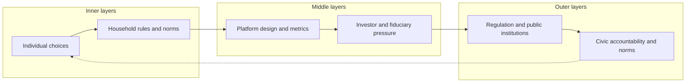

Attention, Substance, and the AI Moment · Part 6

India's digital infrastructure is a remarkable public good: nearly 900 million internet users, more than 650 million smartphones, and some of the cheapest data on earth. The same infrastructure, however, is now tuned to harvest attention at industrial scale. The diagnosis in this series is clear: a 4:1 entertainment-to-education ratio, adolescents more likely to open social media than a learning app, and workers who lose focus before the quarter-hour mark.

Who can change the direction?

Claim C1 India's attention crisis is not solvable by any single actor, but it is movable by the combined leverage of individuals, households, platforms, investors, regulators, and citizens making substance-oriented choices at each layer.

This article is a map of those levers. It argues only that the layers exist, interact, and that ignoring any one is the fastest way to fail.

<h2 id="the-diagnosis-in-one-picture">The Diagnosis in One Picture</h2>

Before the levers, the facts. The evidence across the series points to the same inversion: access was solved; use was not.

The NCAER India Human Development Survey Wave 3 found that <strong>66% of reported internet use is for entertainment</strong>, while about <strong>16% is for education</strong>. ASER 2024 reports that <strong>76% of 14–16-year-olds use smartphones for social media</strong> while <strong>57% use them for education</strong>. Gallup's India data place employee engagement at <strong>23%</strong> in 2025, down from 33% in 2022. The Economic Survey 2025–26 warns that digital addiction threatens the demographic dividend.

Claim C2 The public evidence converges on a single diagnosis: India has built near-universal digital access, but the dominant use of that access is entertainment and social extraction rather than education, work, creation, or rest.

These numbers describe a system, not a moral verdict on users. Cheap data, engagement-optimized feeds, Indic-language content, and weak local safety signals have made India one of the world's largest attention markets. The question is whether the country can redirect that system before the AI moment locks in the current defaults.

<h2 id="six-layers-of-leverage">Six Layers of Leverage</h2>

The map below is a way to locate where change can happen. Each layer has its own incentives, constraints, and speed.

*Accessible description: The diagram shows six nested layers arranged from inner to outer. The inner layers are individual choices and household rules; the middle layers are platform design and investor pressure; the outer layers are regulation and civic accountability. A feedback arrow runs from civic accountability back to individual choices, showing that the layers form a loop rather than a ladder.*

A regulatory change can reshape platform design; a shift in investor expectations can make regulation easier to enforce; household norms can create demand for better platforms. The map is a loop, not a ladder.

<h2 id="the-inner-layers-individual-and-household">The Inner Layers: Individual and Household</h2>

The inner layers are the ones most people control directly. They are also the ones most often blamed, which is backwards. A person can delete apps, set timers, and choose paper books, but those choices become exhausting when every default is set against them.

Still, individual skill matters. The substance-building articles in this series argue for small, repeated acts: a commute spent reading, a paragraph written before checking notifications, a "small rep" that compounds. These are practice in directing one's own attention.

Claim C3 Individual attention practices can reduce personal extraction, but their effect is bounded by platform defaults, social norms, and economic pressure; they work best when supported by household and design changes.

The household layer is arguably the most underused lever in India. Parents, siblings, and shared meals set the grammar of device use. A family that charges phones outside the bedroom, keeps meals screen-free, and talks about what children watched creates a different default than one where every member retreats into a private feed. The NCERT 2022 mental-health survey of more than 379,000 students found that <strong>81% felt anxious about studies and exams</strong> — a signal that the household and school environment matters at least as much as the apps. [The Family's Garden](/articles/the-familys-garden/) explores how households can build small attention contracts that hold.

Household levers are unevenly available. Single-earner families, gig workers, and households with limited space cannot always enforce device-free zones. The point is not to shame families that struggle, but to recognize that where norms can change, they change behavior faster than most policy can.

<h2 id="the-middle-layers-platform-and-investor">The Middle Layers: Platform and Investor</h2>

If the inner layers are where users live, the middle layers are where the architecture is built. Platform design determines what is easy, what is rewarded, and what is hidden.

The current default is well documented: infinite scroll, autoplay, variable rewards, red-dot notifications, and algorithmic feeds that optimise for time-on-site. [The Design of Extraction](/articles/the-design-of-extraction/) documents how these mechanisms make feeds hard to leave. These are the product of metrics chosen by business models. An ad-funded platform that sells attention will design for attention. A subscription platform that sells trust or learning will design for trust or learning.

Claim C4 Platform design is the highest-leverage intervention in the attention economy because a single design default — chronological feed, friction before sharing, or a substance-oriented recommendation signal — can reshape the behavior of millions of users at once. [Friction, Chronological Feeds, and User-Chosen Algorithms](/articles/friction-chronological-feeds-user-chosen-algorithms/) surveys small design changes that reduce extraction without banning anything.

A <a href="https://www.science.org/doi/10.1126/sciadv.abe5641"><em>Science Advances</em> study</a> found social rewards amplify moral-outrage expression online, and a <a href="https://ojs.aaai.org/index.php/ICWSM/article/view/19279">Microsoft Research Bengaluru study</a> found polarised Indian influencers are rewarded with increased retweeting. The <a href="https://digital-strategy.ec.europa.eu/en/policies/dsa-brings-transparency">EU Digital Services Act</a> now requires very large platforms to publish risk assessments, allow vetted researchers to access data, and face audits for systemic harms. These are design-accountability levers, not content-policing levers.

Investors sit just behind the platforms. Pension funds, venture capitalists, and public-market shareholders decide which business models get capital. The BCG creator-economy report shows how concentrated the rewards are: the top 1% of creators capture a large share of ad payments, while the median creator earns far less. An investor who rewards monthly active users will get one internet; an investor who rewards learning outcomes or civic trust will get another.

Claim C5 Investor pressure can shift platform incentives when fiduciaries begin to value long-term attention quality, civic trust, and user autonomy alongside reach and revenue.

This is already happening in parts of the world through ESG scrutiny and shareholder proposals. In India, it remains nascent. The lever is real but unused.

<h2 id="the-outer-layers-regulator-and-citizen">The Outer Layers: Regulator and Citizen</h2>

The outer layers set the rules and the social climate in which the inner and middle layers operate.

Regulation in India has moved from absence to partial presence. The Information Technology Rules 2021 introduced due-diligence obligations for intermediaries. The Digital Personal Data Protection Act 2023 and the DPDP Rules, 2025 create a framework for consent and children's data. The Promotion and Regulation of Online Gaming Act, 2025, noted in the Economic Survey 2025–26, recognizes that some digital products need sector-specific guardrails.

Claim C6 Regulation is a necessary floor for the attention economy, but it is insufficient on its own because rules lag design, enforcement is uneven, and platforms can comply without changing their core extraction model.

The Kerala High Court's December 2024 internal memorandum restricting personal phone use by court staff during office hours is an example of institutional recognition, not a national solution. The EU Digital Services Act offers a more systematic template: transparency reports, researcher data access, algorithmic audits, and age-appropriate design obligations. India does not need to copy it wholesale, but it can learn from the principle that platforms should be accountable for systemic risks, not only illegal content.

Citizens and civil society close the loop. Researchers who document harm, journalists who expose design tactics, fact-checkers who slow misinformation, and users who switch to better-designed services all create pressure that markets and governments cannot generate alone. [Public Pressure and Internal Accountability](/articles/public-pressure-and-internal-accountability/) maps the roles researchers, journalists, whistleblowers, employees, and shareholders can play. The Tele-MANAS programme has received more than 32 lakh calls since its launch, with roughly 70% of callers aged 18–45. That is not only a service metric; it is a signal that civic demand for mental-health support has outpaced the design of the systems that produced the distress.

Claim C7 Civic accountability — research, journalism, whistleblowing, organised user demand, and alternative-platform adoption — is the layer that makes regulation and investor pressure credible.

<h2 id="why-the-layers-must-move-together">Why the Layers Must Move Together</h2>

Each layer has a failure mode. Individuals burn out. Households disagree. Platforms optimise for shareholders. Investors chase returns. Regulators move slowly. Citizens fragment into tribes. The layers compensate for one another.

A platform that introduces friction before sharing reduces the viral spread of outrage, but users must notice and stay. A regulator that mandates transparency creates data for researchers, but researchers need funding and independence. A household that limits screens helps children, but children need substantive alternatives: libraries, parks, sports, and offline youth hubs like those suggested in the Economic Survey.

Claim C8 Sustained change requires aligned movement across all six layers; any single-layer intervention will be absorbed, gamed, or exhausted by the others.

The AI moment makes this coordination more urgent. Artificial intelligence can lower the cost of creation, translation, tutoring, and scientific discovery. It can also lower the cost of extraction: synthetic content, hyper-personalised feeds, AI influencers, and deepfakes. [AI Could Make Extraction Cheaper Too](/articles/ai-could-make-extraction-cheaper-too/) traces how generative AI could deepen the extraction loop before the opportunity window closes. Which path dominates depends on which layers move first. If platforms and investors double down on engagement, extraction accelerates. If regulators, citizens, and households demand substance-oriented design, AI becomes a tool for the substance builder.

<h2 id="sources-and-method">Sources and Method</h2>

This article synthesises evidence from across the <em>Attention, Substance, and the AI Moment</em> series. Primary public sources include the Economic Survey 2025–26 (PIB release), the NSSO Time Use Survey 2024, the NCAER India Human Development Survey Wave 3, ASER 2024, Gallup State of the Global Workplace India data, the BCG creator-economy report, the EU Digital Services Act transparency framework, and Indian regulatory texts including the IT Rules 2021, the DPDP Act 2023 and DPDP Rules, 2025, and the Promotion and Regulation of Online Gaming Act, 2025. Where figures are estimates or global benchmarks applied to India, the text says so.

<h2 id="open-questions">Open Questions</h2>

- Which layer moves fastest in India: household norms, regulatory pressure, investor preference, or user migration?
- Can a substance-oriented business model compete for Indian-language users against ad-funded extraction?
- What metrics should regulators require platforms to disclose so that researchers and users can compare attention quality across services?
- How should AI-generated content be labelled and ranked so that it supports, rather than displaces, human creation?
- What institutional design would give Indian researchers and civil society the access and independence they need to hold platforms accountable?

<h2 id="related-in-this-series">Related in This Series</h2>

- [The Attention Extraction](/articles/the-attention-extraction/) — the overview and thesis of the diagnosis.
- [By the Numbers: What Indians Actually Do Online](/articles/by-the-numbers-what-indians-do-online/) — the data behind the 4:1 entertainment-to-education ratio.
- [The Generational Bet](/articles/the-generational-bet/) — why AI makes the next few years a compounding bet.
- [The Substance Builder](/articles/the-substance-builder/) — practical paths for individual attention practice.
- [Designing for Substance](/articles/designing-for-substance/) — platform incentives and the design of extraction.
- [Product Ideas That Could Shift the Incentives](/articles/product-ideas-that-could-shift-incentives/) — sketches of platforms and products that could reward substance over extraction.
- [Attention, Substance, and the AI Moment: A Series Index](/articles/attention-substance-ai-moment/) — the full series guide and reading paths.
