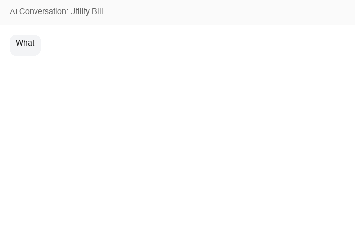
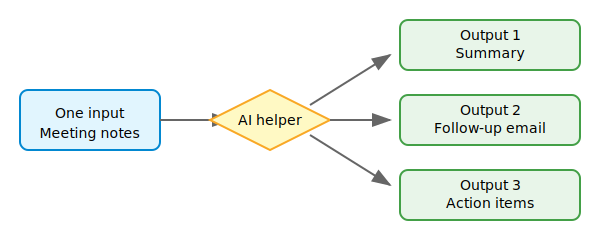

> **Time to read:** about 5 minutes. **Time to try:** about 5 minutes.

If you have been putting off AI because it sounds like tutorials, setup, and
"being good with computers," this is for you.

You do not need to learn AI first. You just need five minutes and the ability to
write an email.

AI helpers are not search engines. They are responsive tools you can talk to.
They keep track of what you said, rephrase when you are confused, and suggest
what to ask next when you are stuck. They do not understand things the way a
person does, but they are very good at organizing information and wording it so
it makes sense to you.

<span id="claim-001" class="claim-marker" data-claim="claim-001">Claim C1</span> A single model-agnostic starter prompt is a more effective onboarding artifact for non-technical users than a feature list or vendor tutorial.

This article gives you one plain-language prompt and two real ways to use it.

<span id="claim-002" class="claim-marker" data-claim="claim-002">Claim C2</span> The AI agent itself can act as the tutor, so newcomers do not need to study AI before they start using it.

---

## The 5-minute recipe

**Step 1: open an AI helper.**

Open any capable AI model in your browser or app. Examples include:

- ChatGPT (chat.openai.com)
- Claude (claude.ai)
- Gemini (gemini.google.com)
- DeepSeek (chat.deepseek.com)
- Qwen (chat.qwenlm.ai)
- Ernie (yiyan.baidu.com)

Most offer a free tier that is enough to try this recipe. If you already have one
open, use that.

**Step 2: copy and paste the prompt.**

Copy this prompt, paste it into the message box, and answer the first question.

```
I want to try using you as a thinking partner for one small everyday problem.

Start by asking me one clear question to understand what I want. After I answer,
suggest 2–3 useful directions and ask me the next best question.

Rules for this conversation:
- Use plain, practical language. Avoid jargon.
- If you are unsure about a fact, say so. Do not guess.
- If I paste a document, explain what it says in simple terms and point out
  anything I should double-check.
- If I seem stuck, suggest one concrete thing I could ask you next.
- If I want to change the topic, just follow me.

After five back-and-forth messages, wrap up with a short summary and stop.
```

That is the recipe. Describe what you want and follow the conversation.

---

## Before you paste anything personal

When the examples below show a bill or notes being pasted into an AI, the
private details have been removed first. Before you paste your own documents,
take out:

- Account numbers and customer IDs
- Full addresses
- Real names (use Person A, Person B)
- Phone numbers, email addresses, bank details

You do not need exact account numbers for the AI to explain a bill.

---

## Example 1: "Explain this utility bill to me"

This shows the AI helper as a plain-language tutor.

**You:** *[pastes the recipe prompt]*

**AI:** What is the everyday problem you would like help with?

**You:** I got a utility bill and I do not fully understand the charges.

**AI:** Please paste the bill text, and I will explain it.

**You:** *[pastes a fictional utility bill with account number removed]*

```
Billing Period: 01-JUN-2026 to 30-JUN-2026
Due Date: 15-JUL-2026
Energy Charges (EC)          ₹980.00
Fixed Charges (FC)           ₹150.00
UDC                          ₹ 65.00
Regulatory Surcharge         ₹ 45.00
Total Amount Due            ₹1240.00
```

**AI:** Here is the bill in plain language:

- **Billing period:** 1 June to 30 June
- **Total due:** ₹1,240 by 15 July
- **Energy Charges (EC):** ₹980 — what you paid for the electricity you used.
- **Fixed Charges (FC):** ₹150 — the basic meter cost, usually the same every month.
- **UDC:** ₹65 — I am not sure what this abbreviation stands for on your bill.
  Check the back of the bill or call your provider to confirm.
- **Regulatory Surcharge:** ₹45 — a government or regulator-mandated fee.

Would you like me to explain any charge in more detail, or show you what happens
if the payment is late?



The AI pulled out the pieces that matter, admitted when it did not know what
"UDC" meant, and offered sensible next questions.

<span id="claim-003" class="claim-marker" data-claim="claim-003">Claim C3</span> Suggesting the next question or direction after each answer removes the blank-page problem and keeps the experience experiential rather than instructional.

---

## Example 2: "Turn these meeting notes into useful outputs"

This shows how the helper can do several tasks at once.

Imagine you have rough notes from a meeting. Normally you would re-read them,
write a follow-up message, and make a task list. With the recipe prompt, you can
ask for all three in one go.

**You:** I have rough meeting notes. I want a short summary, a follow-up email,
and a list of action items with who does what.

**AI:** Please paste the notes.

**You:** *[pastes anonymized notes]*

```
Attendees: Me, Person A, Person B
- Website needs new contact form by Friday
- Person A will check hosting prices
- Person B will send logo files by Wednesday
- Next meeting on Monday 10 AM
```

**AI:** Here are three useful outputs:

**Summary:** We agreed the website needs a new contact form by Friday. Person A
will check hosting prices, Person B will send the logo files by Wednesday, and we
will meet again on Monday at 10 AM.

**Follow-up email:**

```
Hi Person A and Person B,

Thanks for the meeting. Here is what we agreed:

- I will work on the new contact form by Friday.
- Person A, please check hosting prices and share what you find.
- Person B, please send the logo files by Wednesday.

Let us meet again on Monday at 10 AM.

Thanks,
[Your name]
```

**Action items:**

| Task | Owner | Deadline |
|------|-------|----------|
| Build contact form | Me | Friday |
| Check hosting prices | Person A | Soon |
| Send logo files | Person B | Wednesday |
| Next meeting | Everyone | Monday, 10 AM |

One input, three useful outputs.



<span id="claim-004" class="claim-marker" data-claim="claim-004">Claim C4</span> Two short annotated transcripts are enough to teach the pattern: one proving intelligence through document explanation, and one proving productivity through one-input-multiple-outputs automation.

---

## This is not Google, and it is not an old chatbot

| Old way | What it feels like |
|---------|-------------------|
| Search engine | You get links and do the reading and sorting yourself. |
| Old chatbot | You ask one question and get one narrow answer. |
| AI helper | You describe a goal, and it works through the problem with you. |

Google is great for finding web pages. An AI helper is better when you want to
*do something* with information specific to you.

---

## Three more places to try it

- **School:** Paste messy notes and ask for a study plan.
- **Creative projects:** Describe an idea and ask for an outline.
- **Small work tasks:** Paste a long email and ask for a reply, summary, and
  action items.

The recipe stays the same. Only the topic changes.

---

## Three safety rules

AI helpers are useful, but they are not perfect. Keep these three rules in mind:

1. **Verify facts.** If the AI gives you dates, amounts, or medical, legal, or
   financial advice, double-check it elsewhere.
2. **Keep personal details vague.** Do not paste passwords, full addresses,
   bank details, or private health information.
3. **Keep a human in the loop for big decisions.** The AI can help you think,
   but you are still the one who decides.

**Slow down and double-check** when the AI is talking about money, health, law,
or people. If something feels off, ask: *"Are you sure?"* or *"What should I
double-check here?"*

---

## Your turn

Open any AI helper you have access to. Paste the starter prompt. Pick one small
problem—perhaps a bill you do not fully understand or notes you need to turn into
an email. Answer the first question the AI asks you.

That is it. You have started.
