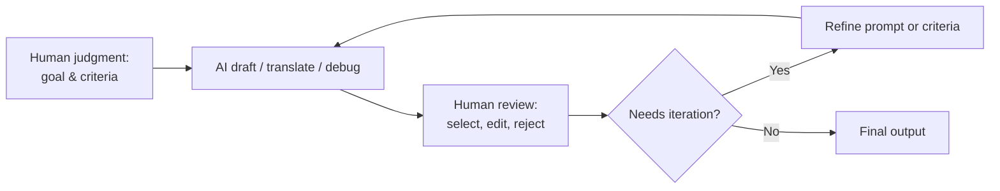

Attention, Substance, and the AI Moment · Part 30

The first draft of anything is intimidating. A blank page, a broken function, a sentence in a language you are still learning, a design that refuses to balance. Generative AI changes the economics of this first step. In seconds it can produce a paragraph, a translation, a debug suggestion, or a layout option. The question is no longer whether AI can help. It is where the help stops and the human work begins.

This article argues for a specific role: AI as a journeyman assistant. Like the apprentice in a workshop who prepares materials and rough cuts but does not sign the finished piece, AI is best used to lower friction and accelerate feedback while human judgment remains responsible for taste, accuracy, and accountability. Claim C1 AI is most useful as a journeyman assistant that lowers friction without replacing human judgment. The value is not in the draft; the value is in what you do with the draft.

<h2 id="the-journeyman-metaphor">The Journeyman Metaphor</h2>

In craft traditions, a journeyman has enough skill to do real work but is not yet trusted with final authority. The journeyman prepares, experiments, and repeats. The master decides what is good enough to leave the shop. This division of labor maps cleanly onto generative AI.

AI can produce a thousand words on any topic, but it cannot know which thousand words serve your reader. It can translate a sentence, but it cannot know the cultural weight a phrase should carry. It can suggest code, but it cannot know whether the code fits the larger architecture or the team's conventions. These gaps are not temporary flaws. They are structural limits. Claim C2 The boundary between using AI and outsourcing thinking is porous and must be actively managed. Every time you accept an AI output, you should be able to say what you changed and why.

The metaphor is useful because it sets expectations. A journeyman assistant is not a master. Treating it as one leads to bland prose, buggy code, and decisions no one can defend.

<h2 id="feedback-loops">Where AI Accelerates Feedback Loops</h2>

The most productive uses of AI are places where the bottleneck is iteration speed rather than strategic choice. A writer can test three introductions before lunch instead of before dinner. A programmer can get a second opinion on an error message without waiting for a colleague. A designer can generate variations to reject. A language learner can practice conversation at midnight. A student can ask for an explanation in different registers until one clicks.

Claim C3 AI can accelerate feedback loops in writing, coding, design, translation, and tutoring. The common pattern is that the human supplies the goal and the criteria, the assistant supplies candidates, and the human selects, edits, and integrates. This loop works best when the cost of generating a candidate is low and the cost of accepting the wrong candidate is visible.

*Human-AI iteration loop: the human supplies the goal and criteria, the assistant produces candidates, and the human reviews before accepting. Based on the article's synthesis of productivity and tutoring research.*

The diagram is simple, but the discipline it requires is not. Each pass through the loop should tighten the human criteria, not just produce another option. If the review step becomes a rubber stamp, the loop collapses into outsourcing.

<h2 id="the-scarce-inputs">The Scarce Inputs Are Still Human</h2>

AI makes many things cheap: first drafts, rough translations, boilerplate code, generic explanations. It does not make judgment, taste, or accountability cheap. These remain scarce because they require a person who understands the context, bears the consequences, and cares about the result.

A manager who delegates a decision memo to AI is still responsible for the decision. A journalist who uses AI to draft a story is still responsible for every quote and fact. A teacher who uses AI to plan a lesson is still responsible for whether students learn. The tool can compress the mechanical steps, but it cannot absorb the moral and professional weight.

Claim C4 Human judgment, taste, and accountability remain the scarce and valuable inputs. This is why the most important skill in an AI-assisted workflow is not prompt engineering; it is the ability to evaluate what comes back and to know when to reject it.

<h2 id="a-few-rules-of-thumb">A Few Rules of Thumb</h2>

If you are folding AI into your work, consider these guardrails:

- **Own the final output.** If your name, brand, or grade is on it, you should be able to explain every major choice in it.
- **Use AI for speed, not for strategy.** Ask it to expand, translate, debug, or reformat—not to decide what is worth doing.
- **Review before you ship.** Treat AI output as a journeyman's rough cut, not a master's finished piece.
- **Keep the loop visible.** Document or at least notice where AI contributed, so you can trace quality problems back to their source.
- **Protect the hard parts.** The thinking that makes you better is usually the thinking you are tempted to skip. Skip that, and the tool saves you time while costing you skill.

These rules are not about avoiding AI. They are about using it in a way that leaves you more capable over time, not less. The journeyman assistant can help you build the thing. Only you can decide whether the thing is worth building and whether it is good enough to stand behind.

<h2 id="sources-and-method">Sources and Method</h2>

This article draws on product documentation from AI tutoring and language-learning tools, emerging research on generative-AI productivity, and practical accounts of AI-assisted workflows in writing, coding, and design. The recommendations are framed as rules of thumb because the long-term effects of routine AI assistance on skill development are still being studied. The underlying principle—that tools amplify judgment rather than replace it—is old; the application to generative AI is new.

<h2 id="related-in-this-series">Related in This Series</h2>

- [The Student's Garden: Learning in Public, Teaching in Private](/articles/the-students-garden/) — how students can use AI as a Socratic tutor without falling into the answer trap.
- [The Worker's Garden: Commutes, Side Projects, and Career Capital](/articles/the-workers-garden/) — similar strategies for working adults reclaiming small windows of time.
- [What AI Makes Cheap](/articles/what-ai-makes-cheap/) — which cognitive tasks generative AI drives toward abundance and which remain scarce.
- [The Substance Builder](/articles/the-substance-builder/) — how deliberate practice and public output compound into skill and reputation.
