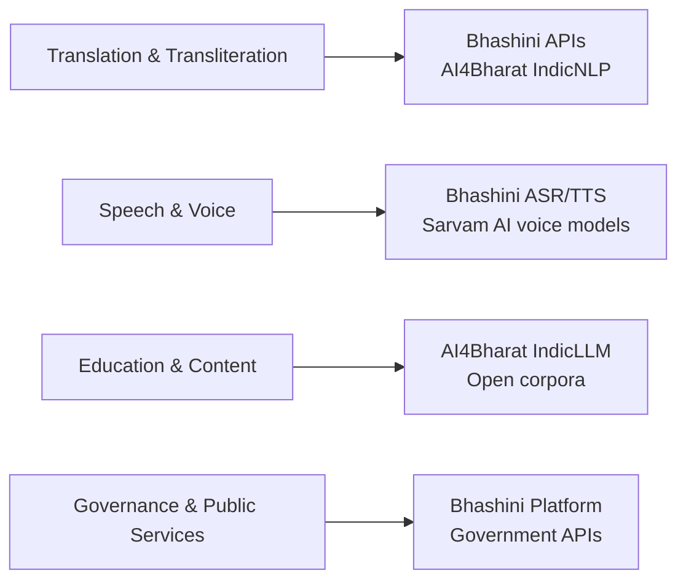

India's internet is not an English internet. Roughly nine in ten users now access content in Indic languages, and that share is growing as rural and first-time users come online. For decades, this linguistic diversity was treated as a friction—something to be overcome with English literacy or dubbed content. AI is beginning to offer a different path: instead of forcing users into one language, it can bring knowledge to them in their own.

Claim C1 The vast majority of Indian internet users access content in Indic languages, so the cost and quality of language technology will shape what kind of information, education, and public discourse reach them.

<h2 id="the-language-reality">The Language Reality</h2>

The headline statistic is striking: the Internet in India Report 2024 finds that **98% of Indian internet users access content in Indic languages**. This does not mean users reject English entirely; many switch between languages depending on context. It does mean that any platform, publisher, educator, or government service that operates only in English is reaching a thin slice of the country.

The gap between languages is also a gap in content quality. Indic-language material on the open web is sparser, less frequently updated, and less well-linked than English material. Search engines, assistants, and recommendation systems therefore have less to work with, which can make Indic results feel second-class even when the underlying technology is neutral. The result is a subtle but real pressure: if you want reliable information, learn English.

AI is starting to change the economics of that choice.

<h2 id="what-the-public-language-stack-looks-like">What the Public Language Stack Looks Like</h2>

Several Indian initiatives are building the datasets, models, and interfaces that Indic-language AI needs. The most visible is **Bhashini**, the government's Digital India language platform, which hosts datasets, translation and speech APIs, and a marketplace of language models across Indian languages. **AI4Bharat** at IIT Madras has released open corpora, Indic NLP tools, and IndicLLM work aimed at researchers and builders. A growing set of startups and labs, including **Sarvam AI**, are building voice-first and large-language models tuned for Indian contexts.

Claim C2 Bhashini, AI4Bharat, and related initiatives have produced open datasets, models, and APIs that lower the engineering barrier for Indian-language applications.

This infrastructure matters because language is a bundle of problems, not one. A useful Indic-language service needs text normalization, transliteration, translation, speech recognition, synthesis, and often code-mixing between languages. Solving any one of these is hard; solving them together has historically required resources only large platforms could afford. The new public and open-source stack distributes some of that capability more widely.

*Capability map of Indic-language AI: domains (left) and the public or open-source providers that supply them (right). Based on Bhashini, AI4Bharat, and Sarvam AI public documentation.*

<h2 id="what-lower-costs-could-unlock">What Lower Costs Could Unlock</h2>

When translation, dubbing, and voice generation become cheap, the pool of people who can produce useful content expands. A teacher in Bhopal can explain a concept in Hindi and have it reach a Tamil-speaking student. A district journalist can report in Odia and see her story translated for a national audience. A small nonprofit can turn one explainer video into a dozen languages without hiring a studio.

Claim C3 Lower translation and voice-generation costs could help local educators, journalists, and builders reach larger, more linguistically diverse audiences.

This is the optimistic case, and it is plausible because it does not require users to change their behavior. People already want content in their own languages. AI simply reduces the cost of meeting that demand with material that is accurate, substantive, and up to date. In health, agriculture, law, and education, the first-order effect could be to move information from scarce and delayed to abundant and immediate.

<h2 id="the-incentive-problem">The Incentive Problem</h2>

Cheaper language technology, however, does not automatically favor quality. It also lowers the cost of producing clickbait, synthetic outrage, and low-effort repackaging in every Indian language. The same translation pipeline that helps a teacher can help a content farm flood platforms with sensationalized versions of the same story.

Claim C4 The real benefit of Indic-language AI depends on whether platforms and business models reward substance, or merely scale low-quality, high-engagement content.

The attention economy already operates in Indic languages. Short-form video, forwarded messages, and algorithmic feeds are not English-only phenomena. If the only business model that can afford language AI is advertising optimized for engagement, then the technology will mostly sharpen extraction, not reduce it. The open question is whether public investment, public-service design, and alternative revenue models can make substance the easier path.

<h2 id="sources-and-method">Sources and Method</h2>

This article draws on the IAMAI-Kantar Internet in India Report 2024 for language-use statistics, on the public websites and documentation of Bhashini, AI4Bharat, and Sarvam AI for the technical landscape, and on general industry reporting about translation and voice AI. Claims about future benefits are framed as contingent on incentives and platform design, not as guaranteed outcomes. The geographic focus is India, but the structural argument—cheaper language technology can either deepen knowledge or deepen distraction—applies wherever multilingual populations meet algorithmic feeds.

<h2 id="related-in-this-series">Related in This Series</h2>

- [What AI Makes Cheap](/articles/what-ai-makes-cheap/) — what generative AI lowers the cost of, and where the savings could go.
- [The Compounding Bet](/articles/the-compounding-bet/) — why small, sustained investments in substance compound over a generation.
- [The Indic-Language Internet and the Vernacular Feed](/articles/the-indic-language-internet-and-vernacular-feeds/) — why language expansion changed the scale and shape of attention extraction.
- [Attention, Substance, and the AI Moment](/articles/attention-substance-ai-moment/) — the full series guide and reading paths.
