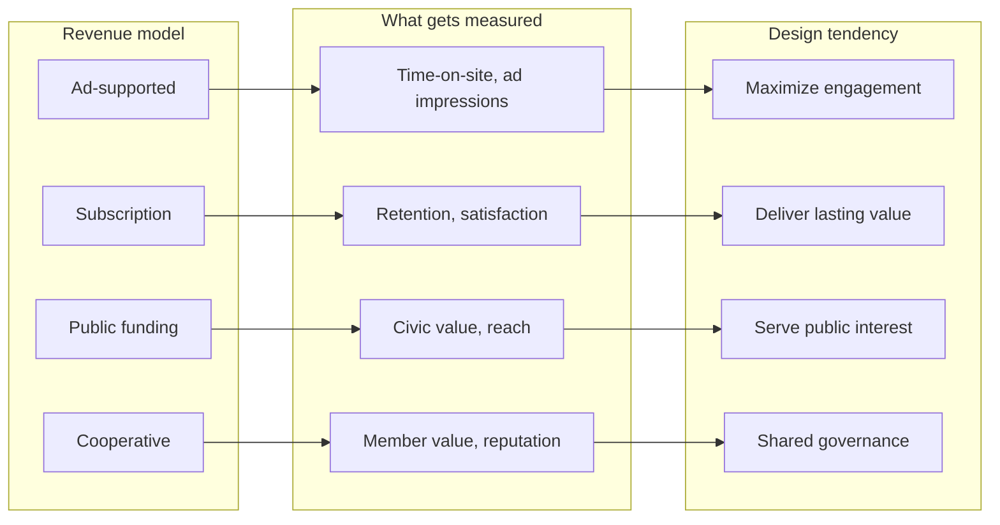

The design of a platform is inseparable from how it makes money. A service that earns revenue by keeping eyes on ads will optimize for engagement: scroll time, clicks, shares, and returns. A service that earns revenue by satisfying users directly can optimize for satisfaction, learning, or trust. This article compares the incentive structures behind different revenue models and asks what a business ecology that rewards substance would look like.

Claim C1 Advertising-funded platforms optimize for time-on-site and ad impressions, which favors engagement over quality.

<h2 id="the-ad-supported-default">The Ad-Supported Default</h2>

Most of the digital services Indians use every day are free at the point of use and funded by advertising. Search, social networks, short-form video, and messaging platforms all run, in large part, on ad revenue. The business model is not hidden: more attention means more ad inventory, and more ad inventory means more revenue. As Ben Thompson's Aggregation Theory argues, the most successful internet platforms tend to commoditize suppliers, centralize demand, and monetize through advertising. The result is a race to capture and hold attention.

This is not a moral failing of any single company. It is the logic of the model. When revenue is tied to impressions and session length, the product team that increases scroll time is rewarded, even if the content that drives that scroll is shallow, divisive, or addictive. Quality becomes a secondary metric because it is harder to tie directly to quarterly revenue. The design choices that follow—autoplay, infinite scroll, algorithmic recommendations optimized for watch time—are predictable consequences of the incentive structure.

<h2 id="subscriptions-and-direct-payment">Subscriptions and Direct Payment</h2>

The simplest alternative is to charge the user directly. Subscriptions align the platform's incentive with the user's continued satisfaction rather than with the advertiser's desire for attention. If readers or viewers can cancel, the product must keep delivering value.

Claim C2 Subscriptions align incentives with user satisfaction and retention.

Patreon, Substack, and a growing share of Indian newsletters and podcasts operate on this principle. Creators are paid by people who want their work, not by brands who want their audience. The Reuters Institute Digital News Report finds that subscription and membership models, while still concentrated in wealthy markets, are slowly expanding in India and other mobile-first countries. The model is not a panacea: it can exclude low-income users and favor already-famous voices. But it does change what the platform measures. Retention, completion rates, and reported usefulness become more important than raw reach.

Direct payment also introduces friction. A user must decide a service is worth money before using it. That friction reduces casual adoption, which is why ad-supported models dominate at scale. The question is whether some of that friction is desirable: it slows the race to the bottom and gives serious creators a more stable signal.

<h2 id="public-funding-philanthropy-and-cooperatives">Public Funding, Philanthropy, and Cooperatives</h2>

Some valuable content will never pay for itself through ads or subscriptions. Civic education, local journalism, scientific research, and open-source software all produce benefits that are widely shared but hard to monetize directly.

Claim C3 Public funding and philanthropy can support content that has civic value but limited commercial appeal.

NPR in the United States, the BBC in the United Kingdom, and Prasar Bharati in India are examples of publicly funded media designed to serve civic goals rather than maximize engagement. Their funding models are not perfect—political pressure, audience decline, and budget constraints are real—but they demonstrate that non-commercial revenue can sustain quality work. Philanthropy plays a similar role for independent journalism, open knowledge projects like Wikipedia, and public-interest technology.

Cooperatives offer another path. In a cooperative, users or workers own the platform, so the incentive is to serve members rather than to extract value from them.

Claim C4 Cooperatives and reputation economies can reward contributions that the market undervalues.

Platform cooperatives, community-owned networks, and open-source projects rely on reputation, reciprocity, and shared governance. Stack Exchange rewards helpful answers with reputation points. GitHub rewards contributions with visibility and professional standing. These systems have their own pathologies—status competition, burnout, and governance disputes—but they show that markets are not the only way to motivate sustained, high-quality work.

<h2 id="why-model-diversity-matters">Why Model Diversity Matters</h2>

*Comparison of how revenue models shape platform incentives. Based on Stratechery's Aggregation Theory and the Reuters Institute Digital News Report.*

No single business model will solve the attention economy. Ads will remain important for reach. Subscriptions will remain important for depth. Public funding and cooperatives will remain important for civic goods. The goal is not to replace one model with another but to create a diverse ecology where different incentives check and balance one another.

A country that relies entirely on ad-funded platforms will get platforms designed for engagement. A country that also has thriving subscription media, public broadcasters, philanthropic journalism, and cooperative platforms has a better chance of sustaining content that educates, informs, and connects. Business-model diversity is a precondition for design diversity.

<h2 id="sources-and-method">Sources and Method</h2>

This article draws on platform analysis (Stratechery's Aggregation Theory), examples of creator funding (Patreon), public media financing (NPR), and comparative media research (Reuters Institute Digital News Report). It also draws on cooperative and reputation-economy examples including Stack Exchange and GitHub. The argument is structural and comparative, not empirical in the statistical sense; it compares how different revenue models shape incentives rather than measuring their effects at scale.

<h2 id="related-in-this-series">Related in This Series</h2>

- [Who Profits?](/articles/who-profits-advertising-foreign-platforms/) — where India's digital advertising money goes and why the creator economy is stratified.
- [Engagement Is a Design Choice](/articles/engagement-is-a-design-choice/) — why ranking metrics are not inevitable, and what alternative metrics could do.
- [Product Ideas That Could Shift the Incentives](/articles/product-ideas-that-could-shift-incentives/) — sketches of platform designs that could reward substance over extraction.
- [Attention, Substance, and the AI Moment](/articles/attention-substance-ai-moment/) — the full series guide and reading paths.
