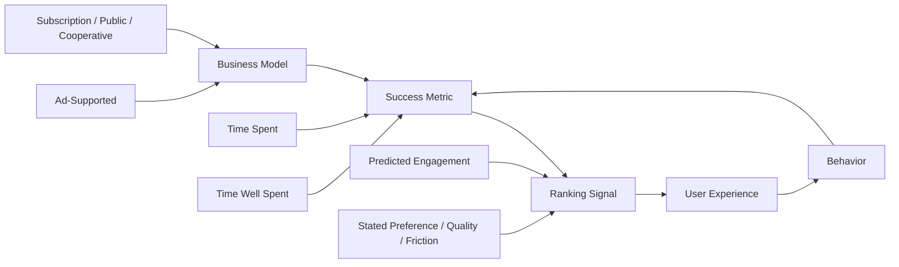

Attention, Substance, and the AI Moment · Part 5

Every feed you open was built by people who made a decision about what to optimize. The order of posts, the autoplay of the next video, the red dot on the notification bell, the pull-to-refresh—each is a design choice. The most consequential choice is the metric. When a platform optimizes for engagement, it gets engagement. The question is whether engagement is the right proxy for value.

Claim C1 Engagement is a design choice, not a natural law; it emerges from the metric a platform chooses to optimize, and that metric can be changed.

This article argues that the attention economy is not inevitable. The same technical infrastructure that now amplifies outrage and rewards extraction could be redirected toward substance—if platforms, regulators, and users treat the metric as a design decision rather than a given.

<h2 id="the-metric-is-the-message">The Metric Is the Message</h2>

Platforms do not try to make users angry for its own sake. They try to maximize a small set of measurable behaviors: time spent, likes, shares, comments, retweets, clicks, and replays. Anger and outrage happen to score well on those metrics. In that sense, the design is rational. The problem is that the metric is narrow.

Claim C2 When a platform ranks content by predicted engagement, it systematically favors content that triggers strong emotional reactions, often at the expense of accuracy, civility, and long-term user well-being.

The consequence is visible in every feed. A carefully reported story competes with a provocative clip. A nuanced explanation competes with a hot take. The algorithm does not hate nuance; it simply cannot measure it. What gets measured gets made.

<h2 id="what-engagement-based-ranking-amplifies">What Engagement-Based Ranking Amplifies</h2>

A landmark randomized experiment by Milli, Carroll, and colleagues compared Twitter's engagement-based ranking algorithm with a reverse-chronological baseline. The study, published in <em>PNAS Nexus</em> and hosted by the Knight First Amendment Institute, found that the engagement-based timeline amplified politically partisan content and content expressing out-group animosity. Among political tweets selected by the algorithm, 62% expressed anger, compared with 52% in the chronological timeline; 46% contained out-group animosity, compared with 38% chronologically. Claim C3 The same study found that users did not actually prefer the political tweets the algorithm chose, suggesting that engagement optimization was catering to revealed behavior rather than stated preference.

The finding matters because it is causal. The only difference between the two conditions was the ranking method. Everything else—users, accounts, content pool—was held constant. The result points to the algorithm itself as a lever of amplification, not to any fixed human appetite for outrage.

<h2 id="the-outrage-feedback-loop">The Outrage Feedback Loop</h2>

Why does engagement-based ranking drift toward outrage? Part of the answer is learning. A 2021 study by Brady, Crockett, and colleagues at Yale, published in <em>Science Advances</em>, analyzed 12.7 million tweets and found that users who received more likes and retweets for outrage-expressing posts went on to express more outrage over time. The effect was strongest among users in politically moderate networks, suggesting that social rewards can pull mainstream users toward more extreme expression.

Claim C4 Likes, shares, and retweets act as reinforcement signals: users learn to produce the content that the platform rewards, and the platform then ranks that content more highly, creating a self-reinforcing feedback loop.

This is not a claim that users are helpless. It is a claim about incentives. A design that rewards moral outrage will produce more of it. A design that rewards clarity, care, or usefulness would produce something else. The technology does not care either way. The designers must choose.

<h2 id="the-business-model-behind-the-metric">The Business Model Behind the Metric</h2>

Metrics do not float free of business models. In an ad-supported platform, revenue is tied to time spent and impressions. The more minutes a user spends scrolling, the more ads can be shown. That structural fact pushes design toward endless feeds, autoplay, variable rewards, and low-friction sharing. It also shapes the creator economy: creators who win are the ones who can hold attention, not necessarily the ones who create the most useful or accurate work.

In India, the scale of this economy is enormous. Meta and Google India together reported gross advertising revenue of roughly ₹57,472 crore (about $6.8 billion) in FY24–25 from their India operations. The Boston Consulting Group estimates that Indian digital creators now influence more than $350 billion in annual consumer spending, yet only 8–10% of creators monetize effectively. Claim C5 The ad-supported attention economy concentrates rewards among top creators and foreign platforms while turning most users' attention into inventory.

The Economic Survey 2025–26 recognized the stakes, flagging digital addiction as a public-health challenge with "real economic and social costs" for India's demographic dividend. When the national policy conversation reaches that point, the design of engagement is no longer a private product decision.

<h2 id="alternative-design-choices">Alternative Design Choices</h2>

If engagement is a design choice, what are the alternatives? The same Milli et al. study explored one: ranking by users' stated preferences rather than predicted engagement. In their exploratory model, this reduced the prevalence of angry, partisan, and out-group-hostile content. The trade-off was a possible reinforcement of echo chambers, because users' stated preferences leaned toward in-group content. The deeper lesson is that no single metric is perfect, but some metrics are less destructive than others.

Other levers are already in use or in law:

- <strong>Chronological or non-personalized feeds.</strong> The EU's Digital Services Act requires large platforms to offer users an option not based on profiling, effectively opening the door to chronological or topic-based alternatives.
- <strong>Friction.</strong> Prompts before sharing, break-after-scroll limits, and default-off autoplay add small costs that can interrupt reflexive behavior.
- <strong>Quality signals.</strong> Some ranking systems incorporate trust, originality, or user-reported satisfaction alongside raw engagement.
- <strong>Different business models.</strong> Subscriptions, patronage, public funding, and cooperative ownership change what the platform is optimizing for, because the customer is the user rather than the advertiser.

Claim C6 Alternative ranking signals, friction, and business models can reduce divisive amplification, but only if platforms are willing to measure success differently.

These are not theoretical fixes. They are design choices, just like the current defaults. The difference is whose time the design is trying to maximize.

<h2 id="what-substance-first-metrics-would-ask">What Substance-First Metrics Would Ask</h2>

A substance-oriented platform would not abandon measurement. It would change what it measures. Instead of asking "Did this keep the user scrolling?" it might ask:

- Did the user leave with a clearer understanding than they arrived with?
- Did the content lead to a constructive conversation or action?
- Did the user return because they chose to, or because they could not stop?
- Did the creator earn attention by being useful, accurate, or original?

These questions are harder to answer than clicks. That is precisely why the current metrics won. But the difficulty of measuring value is not a reason to give up and measure only engagement.

The institutional response is beginning to catch up. The Kerala High Court issued an internal memorandum in December 2024 restricting personal phone use by court staff during office hours. The EU Digital Services Act, India's IT Rules 2021, and the Digital Personal Data Protection Act 2023 all create pressure for greater transparency and user control. These are floors, not ceilings. They make some design choices costlier; they do not by themselves choose better metrics.

Claim C7 At India's scale, the choice of engagement metric is a public-interest question: the same design shapes national attention, social trust, youth learning, and the creator economy.

*Diagram: business model and success metric form a loop with ranking signals, user experience, and behavior. Changing any node changes the others.*

*Accessible description: The flowchart shows a feedback loop. Business model (ad-supported or subscription/public/cooperative) feeds into success metric (time spent or time well spent), which feeds into ranking signal (predicted engagement or stated preference/quality/friction), which feeds into user experience, which shapes behavior, which feeds back into the success metric. Arrows also show alternative inputs entering business model, success metric, and ranking signal.*

<h2 id="sources-and-method">Sources and Method</h2>

This article draws on peer-reviewed experiments (Milli et al., <em>PNAS Nexus</em>; Brady et al., <em>Science Advances</em>), consulting and industry research (BCG's <em>From Content to Commerce: Mapping India's Creator Economy</em>), regulatory filings (Meta and Google India ROC filings), government policy documents (Economic Survey 2025–26, EU Digital Services Act, India's IT Rules 2021 and DPDP Act 2023), and judicial records (Kerala High Court, December 2024). Experimental findings are described as causal within the study conditions; business-model figures are described as reported revenue, not social cost. Global platform-design findings are applied to India as structural parallels, not as India-specific measurements unless stated.

<h2 id="open-questions">Open Questions</h2>

- Which alternative ranking signals best balance user satisfaction, civic health, and creator livelihood in India's multilingual environment?
- Would a chronological or non-personalized default reduce overall screen time, or simply shift it across platforms?
- How much of the creator-economy inequality is driven by platform design versus pre-existing attention inequality?
- Can Indian platforms and public institutions develop domestic alternatives to global ad-supported metrics?
- What would it cost, in revenue and user growth, for a major platform to optimize for time well spent rather than time spent?

<h2 id="related-in-this-series">Related in This Series</h2>

- [The Attention Extraction](/articles/the-attention-extraction/) — the diagnosis of how attention is extracted at scale.
- [By the Numbers: What Indians Actually Do Online](/articles/by-the-numbers-what-indians-do-online/) — the usage mix behind the engagement economy.
- [The Generational Bet](/articles/the-generational-bet/) — why the AI moment makes this choice urgent.
- [The Substance Builder](/articles/the-substance-builder/) — what individual practice can look like.
- [Designing for Substance](/articles/designing-for-substance/) — the broader design arc this chapter belongs to.
- [Attention, Substance, and the AI Moment](/articles/attention-substance-ai-moment/) — the series guide and reading paths.
