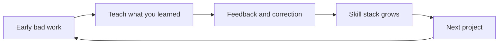

The hardest part of learning anything worth learning is the beginning. Your taste runs ahead of your ability. You can tell what good writing, good code, or good design looks like, but what you produce is not yet good. That gap is uncomfortable, and the attention economy offers an easy escape: a feed where the rewards are instant and the failure is invisible. The first skill, then, is not talent. It is learning to stay in the gap long enough for ability to catch up.

Claim C1 Early work is supposed to be bad; the gap between taste and ability closes through repetition and feedback.

<h2 id="the-gap-is-the-tuition">The Gap Is the Tuition</h2>

In a widely quoted interview, Ira Glass described the beginner's predicament: you get into creative work because you have good taste, but your early output disappoints you. Most people quit in that gap. The ones who build something are the ones who produce a large volume of work while the gap slowly closes. The bad essays, the broken code, the awkward videos are not evidence that you are in the wrong field. They are the tuition.

This is not motivational fluff. Research on deliberate practice finds that expertise grows through repeated cycles of attempt, feedback, and correction aimed at progressively harder goals. Talent matters at the margins, but volume of focused reps matters far more than most beginners expect. The problem in an age of infinite scroll is not that people lack ability; it is that they stop before the reps accumulate. The feed gives them the feeling of learning—new facts, new techniques, new inspiration—without the discomfort of doing it badly.

The antidote is simple and unglamorous: start, finish publicly, and start again. Do not wait until you feel ready. Readiness is a trap. The first versions are meant to be embarrassing in retrospect; that is how you know you have moved on.

<h2 id="teaching-as-a-forcing-function">Teaching as a Forcing Function</h2>

One of the fastest ways to close the gap is to teach while you learn. When you have to explain an idea to someone else, the holes in your own understanding become obvious. You can believe you understand a concept while reading it; you cannot fake understanding once you have to restate it in your own words and answer a beginner's questions.

Claim C2 Teaching forces you to clarify what you actually understand.

This is why public note-taking, blog posts, short videos, and peer study groups are so effective. They create a mild social commitment and a feedback loop. You do not need to be an expert to teach; you only need to be one step ahead of the person you are helping. In fact, the recent expert is often the better teacher because they remember what confused them.

The teaching can be small: a thread explaining one concept, a GitHub readme documenting what you built, a five-minute video walking through a problem. The scale matters less than the act. Each explanation is a mirror. If you cannot make it simple, you do not yet understand it.

<h2 id="the-documented-skill-stack">The Documented Skill Stack</h2>

A hidden record of perfect beginnings is worth far less than a public trail of unfinished but documented projects. The reason is compound. Every project teaches something slightly different: how to frame a question, how to find sources, how to handle feedback, how to iterate, how to abandon an idea gracefully. These layers stack on top of one another even when the individual project fails.

Claim C3 A portfolio of unfinished but documented projects is more valuable than a hidden record of perfect beginnings.

The skill stack is the set of reusable abilities you carry from one attempt to the next. The first blog post teaches you how to finish a draft. The second teaches you how to edit for a reader. The third teaches you how to handle disagreement. None of this happens if the work stays in your notes app. Documented failures are assets; invisible perfection is not.

*The skill-stack loop: each cycle of bad work, teaching, feedback, and correction adds reusable abilities that carry into the next project. Based on the article's synthesis of deliberate practice and learning-by-teaching research.*

This is especially important in India's digital context, where many young people are learning without the traditional scaffolding of elite schools or expensive credentials. A public portfolio can signal capability more credibly than a degree in some fields, and it can be built with nothing more than a phone and an internet connection.

<h2 id="ai-and-the-judgment-gap">AI and the Judgment Gap</h2>

Generative AI changes the economics of starting. It can suggest outlines, debug code, rewrite awkward sentences, and generate practice questions. Used well, it lowers the friction of feedback and lets a beginner get more reps in the same amount of time. Used badly, it becomes a way to skip the struggle that produces judgment.

Claim C4 AI can accelerate feedback loops, but it cannot replace the judgment that comes from repeated practice.

Judgment is the ability to know whether the AI's output is good, appropriate, or relevant. That ability comes from having produced enough work of your own to recognize quality. A student who lets an AI write every essay may finish faster, but will not learn to think. A coder who pastes every solution from a chatbot will not learn to debug. AI is a useful sparring partner, not a substitute for the ring.

The productive pattern is to use AI to expose options, then choose, revise, and explain the choice in your own words. The explanation is the work. If you cannot explain why the AI's version is better, you have not learned; you have outsourced.

<h2 id="sources-and-method">Sources and Method</h2>

This article draws on research on deliberate practice, the learning-by-teaching effect, and effective learning techniques. It also uses Ira Glass's widely cited remarks on the gap between taste and ability as an accessible framing device. The argument is conceptual and practical rather than a report of new empirical findings; readers should treat the recommendations as informed heuristics, not guarantees.

<h2 id="related-in-this-series">Related in This Series</h2>

- [The Small-Rep Theory](/articles/the-substance-builder/#the-small-rep-theory) — why small, focused repetitions beat heroic intensity.
- [The Student's Garden](/articles/the-students-garden/) — how students can use AI as a tutor rather than a ghostwriter.
- [The Compounding Bet](/articles/the-compounding-bet/) — how daily attention choices aggregate into national capacity.
- [Attention, Substance, and the AI Moment](/articles/attention-substance-ai-moment/) — the full series guide and reading paths.
