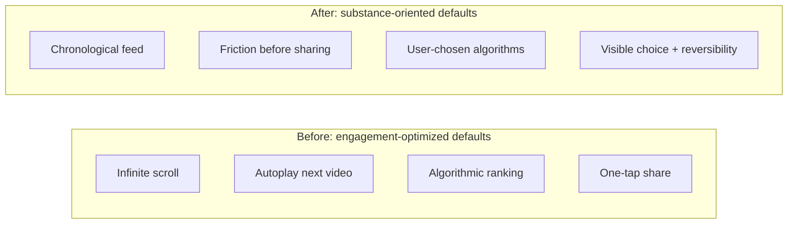

Attention, Substance, and the AI Moment · Part 42

The attention economy is not a law of nature. It is a set of design choices—ranking algorithms, share buttons, autoplay, notifications—repeated billions of times a day. Those choices can be changed. This article looks at three interventions that have enough real-world testing to be taken seriously: chronological feeds, friction before sharing, and user-chosen algorithms. None of them require banning platforms, breaking encryption, or asking users to leave the services their friends already use.

Claim C1 Chronological feeds reduce the power of engagement-optimized recommendations.

<h2 id="chronological-feeds">Chronological Feeds</h2>

Most social feeds today are sorted by what keeps you watching, not by what happened when. The ranking model estimates which post will produce the longest session, the most reactions, or the highest ad yield, and it pushes that post to the top. The result is a feed that feels magnetic and, for many users, endless.

A chronological feed removes that optimization target. It shows posts in the order they were published, with no engagement-based reordering. The signal the platform optimizes for—time on site—is no longer wired directly into the sort order. Early experiments and platform rollouts suggest this simple change can reduce doomscrolling and make the experience feel more controllable. Twitter reintroduced a chronological timeline option after user pressure, and other platforms have followed with variations of "latest first" or "following only" modes.

Chronological order is not a cure-all. It can surface misinformation just as readily as algorithmic order if the underlying network is polarized. It can also bury high-quality posts that a user would have liked but missed because they were asleep or offline. The argument is not that chronology is perfect; it is that chronology changes the incentive. The platform is no longer rewarded for making every scroll slightly more addictive than the last.

<h2 id="friction-before-sharing">Friction Before Sharing</h2>

The share button is one of the most consequential pieces of interface design in modern media. One tap can place a piece of content in front of hundreds or thousands of people before anyone has had time to read it, let alone verify it. Speed is the friend of virality; it is also the friend of falsehood.

Claim C2 Friction before sharing—such as asking whether a user wants to share unverified content—reduces misinformation spread.

Research on feed friction—including field experiments by Pennycook, Rand, and colleagues on accuracy prompts—found that even small delays or prompts can change sharing behavior. When users are asked a simple question—"Are you sure you want to share this?"—or shown that an article is from an outlet that does not meet basic fact-checking standards, a meaningful share of them decide not to proceed. The effect is largest for the most misleading content, which is exactly where the intervention matters most.

Friction does not have to mean censorship. The user can still share. The platform simply introduces a moment of reflection between impulse and distribution. The design assumption shifts from "maximize shares" to "minimize shares the user will later regret." That shift is especially important in India, where WhatsApp and other platforms have been used to spread rumors that have led to real-world harm.

<h2 id="user-chosen-algorithms">User-Chosen Algorithms</h2>

Chronology and friction are defaults. A deeper form of agency is to let users choose the algorithm itself.

Claim C3 User-chosen algorithm modes give agency back to users without requiring them to leave the platform.

Imagine a settings panel that lets a user pick among several ranking modes: "engagement-optimized," "chronological," "quality-weighted," or "posts liked by people I follow." The same network and content pool could be sorted by different values depending on what the user wants at that moment. A student preparing for exams might choose chronological or quality mode. Someone looking for entertainment might choose engagement mode. The point is that the choice is visible and reversible.

The European Union's Digital Services Act has begun to push in this direction: its Article 38 requires very large platforms to offer at least one feed-ranking option that is not based on profiling, such as a chronological feed. The details will be litigated for years, but the principle is clear: when a platform has become infrastructure, its default ordering should not be the only ordering available.

User choice has limits. Most users never open settings. Defaults still shape behavior, so the design of the default menu matters as much as the presence of the menu. But even a minority of users switching to less extractive modes can change the culture of a platform and create market pressure for better options.

<h2 id="visual-summary">Visual Summary</h2>

The same platform can be organized around very different defaults. The diagram below contrasts the engagement-optimized defaults that dominate today with the substance-oriented alternatives discussed in this article.

*Design intervention before-and-after comparison. Sources: Pennycook et al. accuracy-prompt study (Nature, 2021); platform documentation on chronological timelines; EU Digital Services Act, Article 38.*

<h2 id="why-the-changes-are-hard">Why the Changes Are Hard</h2>

If these interventions are so promising, why are they not the norm? The answer is not technical. Chronological sorting, share prompts, and algorithm menus are all straightforward to build. The barrier is commercial.

Claim C4 These changes are technically feasible but often conflict with ad-supported business models.

Advertising-funded platforms make money by keeping users in the app and showing them ads. Engagement-optimized feeds are better at both than chronological feeds. Share prompts that slow distribution also slow the viral growth that attracts new users. User-chosen algorithms might select modes that reduce session length. Every one of these design wins for the user is, from the platform's quarterly-metrics perspective, a potential loss.

That is why voluntary adoption has been slow and partial. Platforms have added chronological options and some sharing prompts, but usually as secondary features buried in settings, not as defaults. The business model rewards extraction, and design follows the business model.

This does not mean change is impossible. Regulation, competition, public pressure, and internal employee advocacy have all moved platform behavior in the past. The question is whether India—and other large markets—will treat attention extraction as a design problem that warrants design standards, or continue to accept the defaults that global platforms hand down.

<h2 id="sources-and-method">Sources and Method</h2>

This article draws on Pennycook et al.'s 2021 Nature study on accuracy prompts and misinformation sharing, platform documentation on chronological timelines and well-being research, and the EU Digital Services Act (Article 38). It also uses Pew Research Center data on social media use as background context. Causal claims are limited to what the underlying studies support; most findings are about behavioral effects in specific experimental or platform settings, not universal laws of human attention.

<h2 id="related-in-this-series">Related in This Series</h2>

- [Designing for Substance](/articles/designing-for-substance/) — the broader design agenda this article sits inside.
- [Engagement Is a Design Choice](/articles/engagement-is-a-design-choice/) — why platform defaults are decisions, not inevitabilities.
- [Business Models That Reward Substance](/articles/business-models-that-reward-substance/) — how revenue models shape the design choices available.
- [Attention, Substance, and the AI Moment](/articles/attention-substance-ai-moment/) — the full series guide and reading paths.
