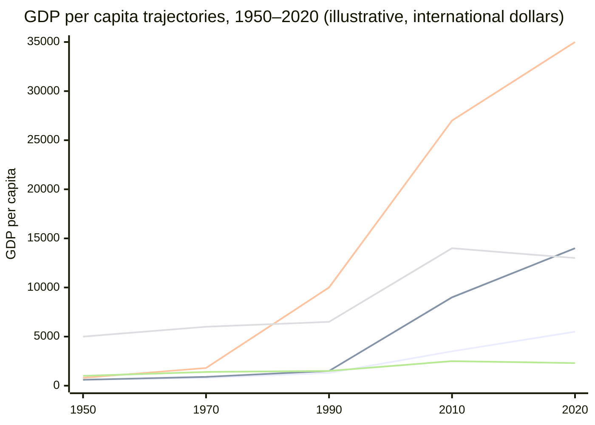

Attention, Substance, and the AI Moment · Part 27

History does not repeat, but it rhymes. Every few generations a technology arrives that reshapes what economies produce, who leads, and who follows. The countries that recognized the hinge early—industrialization in Britain, electrification in Germany and the United States, personal computing and the internet in the United States and East Asia—gained compounding advantages that lasted for decades. The countries that arrived late, or that treated the new technology as someone else's story, often spent a century catching up. India now stands at another such hinge. The question is not whether AI will matter; it is whether India will be among the shapers or the shaped.

Claim C1 Late industrialization was associated with slower long-run income growth and greater dependency.

<h2 id="the-pattern-of-missed-transitions">The Pattern of Missed Transitions</h2>

The industrial revolution is the most studied case. Britain's early adoption of steam power, mechanized textile production, and railroads created a productivity lead that other regions spent much of the nineteenth and twentieth centuries trying to close. The Maddison Project data on long-run income shows a wide and persistent gap between early industrializers and regions that industrialized later. Acemoglu and Robinson's work on institutions and economic development argues that the difference was not only technology but also who controlled it: countries that built inclusive institutions and broadly distributed productive capacity grew faster than those that remained dependent on extractive arrangements.

Electrification followed a similar pattern. The United States and Germany wired factories, homes, and transport systems in the late nineteenth and early twentieth centuries, while many other regions lagged by decades. The productivity gains from electric motors and continuous-process manufacturing accrued first where the grid, the machines, and the skills were built together. Countries that imported generators without building the surrounding ecosystem gained light bulbs without industrial transformation.

The personal-computing and early-internet wave repeated the pattern at a faster tempo. The United States, followed by parts of East Asia and Northern Europe, created hardware, software, and platform ecosystems that became global standards. Late adopters could use the same tools, but they often used them as consumers of foreign platforms rather than as producers of their own technology, standards, and intellectual property.

These analogies are not deterministic. History is full of leapfroggers—countries that skipped fixed-line telephony and went straight to mobile phones, for example. But the leapfrog cases usually involved deliberate national investment, education, and institutional adaptation, not passive adoption.

<h2 id="what-the-gaps-cost">What the Gaps Cost</h2>

The cost of missing a transition shows up in three places: income, productivity, and sovereignty.

Claim C2 The PC and early-internet divide left lasting productivity gaps between adopters and laggards.

*Illustrative GDP per capita trajectories from 1950 to 2020. Lines, from top to bottom in 2020: South Korea (green), Argentina (blue), China (orange), India (purple), Nigeria (red). Values are approximate and based on Maddison Project Database trends; they are meant to show relative divergence, not precise year-by-year estimates.*

The World Bank's 2016 World Development Report on digital dividends found that while digital technologies had spread rapidly across the developing world, the economic payoffs were uneven. Access alone was not enough. Countries that also invested in human capital, competition, and accountable institutions captured larger productivity gains. Those that did not often saw digital tools amplify existing inequalities without transforming production. The report's central caution—that the internet's benefits are not automatic—maps cleanly onto earlier transitions.

Sovereignty is the less visible cost. When a country imports its computing stack, its search engines, its operating systems, and its social platforms, it also imports the decisions embedded in those systems: content policies, data practices, payment rails, and technical standards. Over time, that dependency constrains policy space. It is not a conspiracy; it is a consequence of arriving at the table after the rules have been written.

<h2 id="why-ai-is-the-next-hinge">Why AI Is the Next Hinge</h2>

Artificial intelligence has the hallmarks of a general-purpose technology: it touches many sectors at once, it improves as it scales, and its full benefits depend on complementary investments in skills, data, and infrastructure. Like electrification or computing, it is likely to reward the countries that build the surrounding ecosystem, not only the ones that download the end-user app.

Claim C3 AI is likely to have a similar compounding effect on productivity, defense, and scientific discovery.

The IMF's analysis of generative AI and the future of work suggests that advanced economies and some emerging markets are better positioned to capture near-term productivity gains because of their higher shares of cognitive-task employment and stronger digital infrastructure. The same analysis warns that without active adaptation, AI could widen gaps between leaders and laggards rather than narrow them. In defense, scientific research, and industrial automation, early leadership in AI tends to compound because the technology feeds on data, talent, and feedback loops that are hard to replicate quickly.

The risk for late adopters is not that they will have no AI. Cheap models and open weights make access easier than access to mainframes or semiconductor fabs once was. The risk is that they will use AI as a layer on top of someone else's stack—consuming models, platforms, and standards designed elsewhere—without building the domestic research, data governance, and application ecosystems that turn access into advantage.

<h2 id="indias-window">India's Window</h2>

India has reasons for cautious optimism. It has one of the world's largest pools of software engineers, a young population, a thriving startup ecosystem, and a national push on Indic-language AI through initiatives like Bhashini. The country's IT services industry already earns global trust. Its diaspora includes leaders at major AI labs. These are real assets.

Claim C4 India's large talent base gives it a window, but the window is not indefinitely open.

Yet talent alone is not destiny. The same demographic dividend can become a dividend or a disappointment depending on what that talent is directed toward. If India's best engineers spend their careers optimizing engagement metrics for foreign platforms, the window narrows. If they build foundational models, scientific tools, public-interest applications, and domestic platforms, the window widens. The transition from "world's back office" to "world's AI co-builder" is possible, but it requires sustained investment in research, compute, data infrastructure, and education, and it requires moving before the global architecture hardens.

The attention argument of this series matters here too. A country whose young people spend most of their digital hours consuming entertainment and social media is a country that is using the internet as a consumption device, not a production device. AI could deepen that consumption pattern—better recommendations, more addictive feeds, cheaper synthetic content—or it could become a tool for creation, translation, tutoring, and research. The historical analogies suggest that the difference will show up in income and sovereignty decades from now.

<h2 id="sources-and-method">Sources and Method</h2>

This article draws on long-run economic data (Maddison Project Database), institutional economic history (Acemoglu and Robinson, <em>Why Nations Fail</em>), the World Bank's 2016 World Development Report on digital dividends, the IMF's staff analysis of generative AI and the future of work, and Indian technology-policy sources including NASSCOM publications. The historical comparisons are analogies, not forecasts; they are meant to illuminate risks and opportunities, not to predict a single path. Where possible, the text distinguishes between documented correlations and contested causal claims.

<h2 id="related-in-this-series">Related in This Series</h2>

- [Attention, Substance, and the AI Moment](/articles/attention-substance-ai-moment/) — the full series guide and reading paths.
- [By the Numbers: What Indians Actually Do Online](/articles/by-the-numbers-what-indians-do-online/) — the diagnosis of India's digital time budget.
- [AI Could Make Extraction Cheaper Too](/articles/ai-could-make-extraction-cheaper-too/) — how AI can deepen attention extraction unless design changes.
- [Bhashini and the Indic-Language AI Moment](/articles/bhashini-and-the-indic-language-ai-moment/) — India's opportunity to turn language diversity into an AI advantage.
