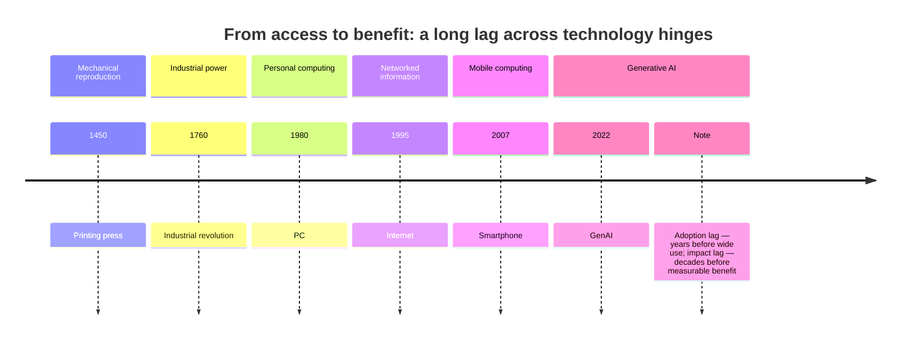

Every few centuries, a new tool arrives that promises to change everything. Usually, it does—but not in the first decade, and rarely in the way its inventors imagined. Access comes first. The benefits arrive later, unevenly, and only after societies build the habits, rules, and institutions that steer the tool toward useful ends. The smartphone and artificial intelligence are the latest in this long line of historical hinges.

Claim C1 The printing press initially produced a flood of pamphlets and misinformation before stabilizing into modern publishing norms.

<h2 id="the-press-and-the-pamphlet-flood">The Press and the Pamphlet Flood</h2>

Gutenberg's press did not create the Reformation, the scientific revolution, or the modern newspaper overnight. It created *capacity*. For the first time, one person could make hundreds of copies of an idea in days rather than months. The first wave of that capacity was not sober scholarship. It was pamphlets, prophecies, libels, and sectarian attacks. Print made it cheap to spread any claim, and the institutions that would later separate reliable knowledge from noise—editorial boards, libraries, peer review, copyright, libel law—did not yet exist.

Elizabeth Eisenstein's study of the printing press argues that the technology helped fix and standardize texts, which in turn made cumulative knowledge possible. But the same machine also amplified confusion. The stabilizing effects took generations. Universities, learned societies, newspapers, and eventually professional journalism were the institutions that turned access into reliable public knowledge. Without them, the press was mainly a faster way to circulate whatever people already wanted to believe.

<h2 id="steam-smoke-and-the-long-lag">Steam, Smoke, and the Long Lag</h2>

The industrial revolution followed the same pattern. Steam power, factories, and railways eventually raised living standards on a scale never seen before. But the first effects were not broadly shared prosperity. They were child labor, dangerous machinery, fouled rivers, overcrowded cities, and the destruction of crafts that had supported families for generations. The benefits took more than a century to diffuse, and they depended on public sanitation laws, compulsory schooling, trade unions, factory inspectors, and the gradual shift from muscle to machine-intensive work.

Claim C2 The industrial revolution raised living standards over generations, but early disruptions included child labor, pollution, and urban squalor.

The point is not that industrialization was a mistake. It is that the gap between access and benefit was filled by political struggle, institutional invention, and painful learning. Technology did not hand out its rewards automatically. It distributed them according to who had the power, knowledge, and organization to capture them.

*A schematic timeline of major technology hinges. The intervals are approximate; in each case, institutional and normative adaptation followed access by years or decades. Sources: historical scholarship summarized in Eisenstein, Brynjolfsson, and Thompson.*

<h2 id="the-productivity-paradox">The Productivity Paradox</h2>

The personal computer and the early internet repeated the pattern in living memory. By the 1980s, computers were appearing on desks across rich countries. By the 1990s, the internet was connecting them. Yet measured productivity growth in many economies remained slow for years. Economists called it the "productivity paradox": the technology was clearly powerful, but the economic accounts did not show it.

Claim C3 The personal computer and early internet had a "productivity paradox" before organizational practices caught up.

Research by Erik Brynjolfsson and others suggests that the gains came only after firms redesigned their processes, retrained workers, and changed how decisions were made. The tool was not enough. The surrounding organization had to change too. A factory that plugs a computer into an old workflow gets faster paperwork, not a new business. A school that gives students tablets without changing pedagogy gets digital textbooks, not better learning.

<h2 id="the-smartphone-hinge">The Smartphone Hinge</h2>

India's digital story is one of the fastest access transitions in history. Cheap data, cheap handsets, and Indic-language content brought hundreds of millions online in less than a decade. The same infrastructure can deliver a university lecture, a government service, a market price, or a medical diagnosis. It can also deliver an infinite scroll of distraction designed to capture attention and sell it to advertisers.

Claim C4 Smartphones and AI are at a similar hinge: access is here, but the institutions for healthy use are still forming.

This is the hinge. The technology is no longer the bottleneck. The bottleneck is the set of norms, designs, regulations, and habits that determine whether the tool cultivates attention or extracts it. Schools are still figuring out how to teach with and around screens. Families are still negotiating device rules without clear social scripts. Platforms are still rewarded for time spent rather than value created. Policymakers are still treating the internet mainly as an access success story rather than a use problem.

Artificial intelligence intensifies the hinge. It makes many kinds of creation, translation, tutoring, and analysis cheaper than ever. It also makes misinformation, manipulation, and shallow simulation cheaper than ever. The same pattern repeats: access first, benefits later, with the distribution depending on who learns to use the tool well.

<h2 id="what-the-pattern-teaches-us">What the Pattern Teaches Us</h2>

History does not predict the future, but it does warn against a common mistake: assuming that access to a powerful tool is the same as benefiting from it. Every major technology creates both flourishing and waste. The ratio between them is not fixed by the technology. It is shaped by literacy, institutions, norms, and design choices.

For India, this means the digital-access achievement is the beginning of the story, not the end. The question is not whether more people can get online. It is whether the country can build the equivalent of editorial standards, factory inspectors, and organizational redesign for the attention economy. If it does, the same phone that drains a student's evening can also tutor her through an exam, connect a farmer to a market, and let a young worker build a skill. If it does not, access will remain access, and the benefits will keep leaking toward whoever knows best how to capture attention.

<h2 id="sources-and-method">Sources and Method</h2>

This article draws on historical scholarship about the printing press and industrial revolution, economic research on the productivity paradox, and media theory about technology and society. It uses these cases as analogies for India's current digital transition, not as proofs. The claim is not that smartphones are identical to steam engines or printing presses, but that major tools repeatedly separate access from benefit until institutions catch up. Where the argument moves from historical case to present-day implication, the text signals the analogy explicitly.

<h2 id="related-in-this-series">Related in This Series</h2>

- [The Life-Phase Thread](/articles/the-life-phase-thread/) — how attention habits shape outcomes across a human life.
- [The Green Revolution Trade-Off](/articles/the-green-revolution-trade-off/) — another Indian case of solving one problem while creating slower, structural costs.
- [The Generational Bet](/articles/the-generational-bet/) — why the AI transition is a habit problem, not only a technology problem.
- [Attention, Substance, and the AI Moment](/articles/attention-substance-ai-moment/) — the full series guide and reading paths.
