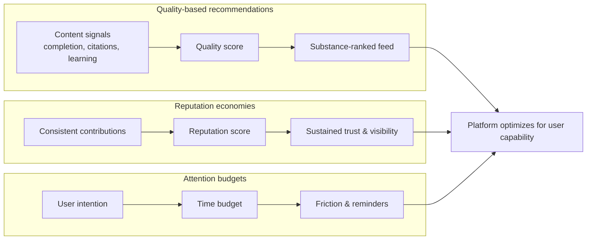

Attention, Substance, and the AI Moment · Part 47

Most social platforms are designed to ask one question of every post: “Will this keep the user scrolling?” That question is not evil; it built a trillion-dollar industry and gave billions of people a place to speak. But it is narrow. It treats attention as the only scarce resource and fails to ask what the attention produces. A different product could ask, “Will this leave the user more capable, more informed, or more connected than before they arrived?”

That shift is not hypothetical. Several existing designs already reward quality, usefulness, and reputation over raw engagement. The question for India—and for every mobile-first country—is whether those designs can be scaled, adapted, and made the default rather than the exception.

<h2 id="quality-signals-beyond-the-click">Quality Signals Beyond the Click</h2>

The dominant feed is optimized for clicks, likes, shares, and time-on-screen. Those signals are easy to measure and easy to game. A more substance-oriented feed would add signals that are harder to fake: Did the user finish the content? Did they return to it later? Did they cite it in their own work? Did they report that they learned something?

Claim C1 Quality signals—such as citations, completion rates, and user-reported learning—can complement engagement signals and steer recommendation systems toward substance.

Stack Exchange uses upvotes, downvotes, and accepted answers to surface helpful explanations. GitHub uses stars, forks, and contribution history to signal which projects are maintained and trusted. These systems are imperfect, but they show that platforms can rank by something other than watch time. The challenge is designing signals that work across languages, literacy levels, and network speeds rather than importing a Western Q&A model wholesale.

<h2 id="public-interest-algorithms">Public-Interest Algorithms</h2>

Recommendation algorithms do not have to be engagement maximizers. They can be designed to surface locally relevant, verified, and constructive content: flood alerts, vaccination schedules, exam results, agricultural prices, civic deadlines, and fact-checked explanations of unfolding events.

Claim C2 Public-interest algorithms could surface locally relevant, verified, and constructive content when the stakes are high.

The Mozilla Foundation’s YouTube Regrets research documented how engagement-based recommendation can push users toward harmful or misleading content. The inverse is also possible: a public-interest layer could temporarily prioritize authoritative information during elections, epidemics, or natural disasters. The hard part is governance. Someone must define “public interest,” and that someone must be accountable. A safer design would make the ranking objective visible and contestable rather than hiding it inside a black box.

<h2 id="reputation-not-virality">Reputation, Not Virality</h2>

Viral moments are a fragile way to build a creative economy. One video explodes; the next is ignored. A reputation economy, by contrast, rewards consistency: the teacher who explains clearly every week, the journalist who verifies before posting, the developer who maintains a small but essential tool.

Claim C3 Creator reputation economies can reward consistent quality over viral moments.

Reddit karma, Stack Exchange reputation, and GitHub contribution graphs are all forms of accumulated credibility. They are not perfect—reputation can be gamed, cliqued, or inflated—but they give creators a reason to invest in long-term trust rather than one-shot outrage. For India, a reputation layer could help vernacular creators, educators, and local journalists build audiences that follow them for reliability rather than shock.

<h2 id="attention-budgets-and-agency">Attention Budgets and Agency</h2>

Even the best platform defaults can be overridden by users. The final design layer is the user’s own attention budget: tools that make time visible, set daily limits, and let people choose what they want to optimize for.

Claim C4 User-owned attention budgets and time-well-spent dashboards can restore agency without removing choice.

Operating systems and some apps already report screen time. A more useful version would let users set intentions—“I want 30 minutes of learning today,” “No feeds after 9 p.m.”—and measure progress against those intentions. The Center for Humane Technology’s “Time Well Spent” framing argues that technology should respect the user’s goals, not just the platform’s. Evidence on whether dashboards alone change behavior is mixed, but dashboards combined with friction and default limits can nudge usage in healthier directions.

<h2 id="visual-summary">Visual Summary</h2>

*Conceptual model of three product designs that shift platform incentives from raw engagement toward substance, quality, and user agency. Based on platform examples and design proposals discussed in the article.*

<h2 id="sources-and-method">Sources and Method</h2>

This article draws on platform documentation and community design examples (Reddit karma, Stack Exchange reputation, GitHub stars), research on recommendation harms (Mozilla Foundation’s YouTube Regrets research), and advocacy around humane design (Center for Humane Technology). The product sketches are conceptual and are offered as design directions, not proven blueprints. Where examples come from specific platforms, the text says so.

<h2 id="related-in-this-series">Related in This Series</h2>

- [Attention, Substance, and the AI Moment](/articles/attention-substance-ai-moment/) — the full series guide and reading paths.
- [Designing for Substance](/articles/designing-for-substance/) — how platform incentives choose what is easy.
- [Engagement Is a Design Choice](/articles/engagement-is-a-design-choice/) — why ranking metrics are not inevitable.
- [Alternative Metrics and Time Well Spent](/articles/alternative-metrics-time-well-spent/) — how different measures of success could reshape feeds.
