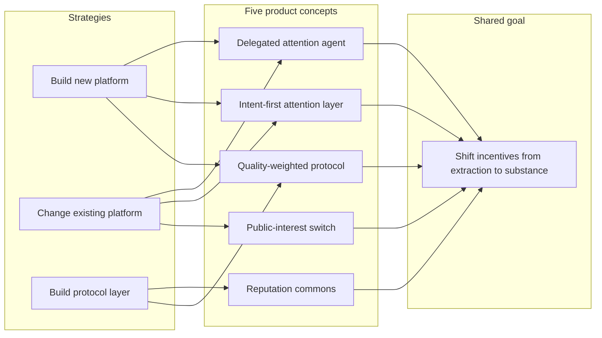

Attention, Substance, and the AI Moment · Part 47

Most social platforms are still built around one question: “Will this keep the user scrolling?” That question built a trillion-dollar industry and gave billions of people a voice, but it is narrow. It treats attention as the only scarce resource and rarely asks what the attention produces. The forty-nine-article series behind this piece argues that the cost of that narrowness is now visible: sleep loss, learning displacement, civic disengagement, and a creator economy that rewards outrage over reliability.

This article takes the next step. It asks what products, platforms, or protocols could change the incentive structure itself. The answers are not simple. There is no single feature that will fix the attention economy. But there is a landscape of design directions—some proven in small domains, some still speculative—that could reward substance over extraction if the right conditions align.

Claim C1 A platform that asks “Did this leave the user more capable, informed, or connected?” would need different signals, ranking objectives, and business models than one that asks only “Did this keep the user watching?”

The question is not whether such platforms are possible in principle. The question is where they can gain traction: inside existing platforms, as new entrants, or as protocol layers that multiple platforms can adopt.

<h2 id="the-strategic-choice">The Strategic Choice: Build New, Change Existing, or Build a Protocol</h2>

Anyone trying to shift attention incentives faces three broad strategies.

<strong>Build a new platform.</strong> A clean slate lets designers encode different incentives from day one: subscription revenue instead of ads, quality signals instead of clicks, reputation instead of virality. The obstacle is distribution. Network effects, default apps, and pre-installed software make it hard for a new social product to reach scale. History is full of well-intentioned alternatives that failed to cross the adoption chasm.

<strong>Change an existing platform.</strong> Existing platforms already have users, creators, advertisers, and regulatory relationships. A ranking change or a new toggle can reach hundreds of millions of people quickly. The obstacle is incentive misalignment. Shareholders expect growth, advertisers expect reach, and product teams are optimized for engagement metrics. Internal reform is possible—platforms have introduced chronological options, screen-time dashboards, and downranking rules—but it tends to be partial and reversible.

<strong>Build a protocol or interoperability layer.</strong> Protocols can shift incentives without requiring anyone to win the platform war. RSS, email, and the web itself are protocol successes: no single company owns them, but everyone can build on them. A protocol for quality signals, reputation, or attention budgets could let existing platforms compete on healthier dimensions without surrendering their user bases. The obstacle is coordination. Protocols need standards bodies, reference implementations, and enough adoption to matter.

Claim C5 Build-new platforms can optimize for substance from inception but face brutal cold-start and network-effects barriers; change-existing strategies have distribution but face incumbent incentive resistance; protocol layers can avoid the winner-take-all problem but require coordination and adoption.

No path is clearly dominant. The right answer likely depends on the specific behavior being changed, the market, and the regulatory environment. In India, where most users are mobile-first, data-conscious, and multilingual, a substance-first product would have to work on low-end devices, in Indic languages, and often offline—not merely import a Western design.

<h2 id="survey-of-design-directions">A Survey of Design Directions</h2>

Before proposing specific products, it helps to map the design space. The following directions are not mutually exclusive; many of the strongest concepts combine several of them.

<h3 id="quality-signals-beyond-the-click">Quality Signals Beyond the Click</h3>

The dominant feed optimizes for clicks, likes, shares, watch time, and retention. Those signals are easy to measure and easy to game. A substance-oriented feed would add signals that are harder to fake: completion rates, return visits, citations, saved-for-later actions, user-reported learning, and expert or community moderation.

Quality signals—such as citations, completion rates, and user-reported learning—can complement engagement signals and steer recommendation systems toward substance.

Stack Exchange uses voting, accepted answers, and reputation to surface explanations the community finds useful. GitHub uses stars, forks, and contribution history to signal which projects are maintained and trusted. These systems reward sustained contribution rather than one-shot virality. The challenge is translating them to video, audio, and low-literacy contexts where “completion” may mean something different and where citation networks are thinner.

<h3 id="public-interest-algorithms">Public-Interest Algorithms</h3>

Recommendation algorithms can be designed to surface locally relevant, verified, and constructive content during high-stakes periods: flood alerts, vaccination schedules, exam results, agricultural prices, civic deadlines, and fact-checked explanations of unfolding events.

Claim C2 Public-interest algorithms could surface locally relevant, verified, and constructive content when the stakes are high.

Mozilla Foundation’s YouTube Regrets research documented how engagement-based recommendation can push users toward harmful or misleading content. The inverse is possible but harder to govern. Someone must define “public interest,” and that definition must be accountable. A safer design would make the ranking objective visible and contestable rather than hiding it inside a black box. The EU Digital Services Act already requires large platforms to explain recommender-system parameters and offer at least one non-profiling option, showing that regulation can accelerate this direction.

<h3 id="reputation-not-virality">Reputation, Not Virality</h3>

Viral moments are a fragile way to build a creative economy. One video explodes; the next is ignored. A reputation economy rewards consistency: the teacher who explains clearly every week, the journalist who verifies before posting, the developer who maintains a small but essential tool.

Claim C3 Creator reputation economies can reward consistent quality over viral moments.

Reddit karma, Stack Exchange reputation, and GitHub contribution graphs are all forms of accumulated credibility. They are imperfect—reputation can be gamed, cliqued, or inflated—but they give creators a reason to invest in long-term trust rather than one-shot outrage. For India, a reputation layer could help vernacular creators, educators, and local journalists build audiences that follow them for reliability rather than shock.

<h3 id="attention-budgets-and-agency">Attention Budgets and Agency</h3>

Even the best platform defaults can be overridden by users. The final design layer is the user’s own attention budget: tools that make time visible, set daily limits, and let people choose what they want to optimize for.

Claim C4 User-owned attention budgets and time-well-spent dashboards can restore agency without removing choice.

Operating systems and some apps already report screen time. A more useful version would let users set intentions—“I want 30 minutes of learning today,” “No feeds after 9 p.m.”—and measure progress against those intentions. The Center for Humane Technology’s “Time Well Spent” framing argues that technology should respect the user’s goals, not just the platform’s. Evidence on whether dashboards alone change behavior is mixed, but dashboards combined with friction and default limits can nudge usage in healthier directions.

<h3 id="agent-mediated-attention">Agent-Mediated Attention Stewards</h3>

AI agents could become attention defenders rather than attention harvesters. A user-aligned agent could filter, summarize, schedule, and rank incoming information against explicit goals: “Prepare me for this meeting,” “Keep me informed on climate policy without doomscrolling,” “Find me one good explanation of this topic per week.”

Claim C7 Agent-mediated attention stewards can defend user intent if they are genuinely buyer-aligned, privacy-preserving, and transparent about whose interests they serve.

The risk is that the agent itself becomes a new platform. If the agent is owned by an ad-supported company, it may optimize for engagement dressed up as delegation. If it is buyer-aligned and auditable, it could reduce the cost of ignoring low-value content. The same agentic-commerce reasoning explored elsewhere in this series—delegated intent, evidence packets, decision receipts—applies to attention curation.

<h3 id="creator-economy-realignment">Creator-Economy Realignment</h3>

Business models shape what gets made. Ad-supported platforms optimize for time-on-site; subscription and patronage models optimize for satisfaction; public funding and cooperatives optimize for civic value.

Claim C8 Creator-economy realignment—through subscriptions, patronage, public funding, and cooperative ownership—can change the metrics that matter and reduce dependence on attention extraction.

Patreon, Substack, and a growing share of Indian newsletters and podcasts operate on direct payment. Public broadcasters such as NPR, the BBC, and Prasar Bharati sustain civic content that advertising alone would not. Platform cooperatives and open-source projects rely on reputation and shared governance. None of these models is perfect, but their coexistence creates space for designs that ads alone would not fund.

<h2 id="five-product-concepts">Five Product Concepts</h2>

The following concepts are deliberately differentiated. Some are platform-native, some are protocol-like, and some are agent-mediated. None is presented as a guaranteed fix; each is a design hypothesis with rationale, risks, and open questions.

<h3 id="concept-quality-protocol">Concept A: A Quality-Weighted Ranking Protocol</h3>

<strong>What it is.</strong> An open protocol—similar in spirit to Schema.org or ActivityPub—that defines quality signals for content ranking. Platforms could adopt it voluntarily or be required to expose compatible signals. The protocol would standardize fields such as completion rate, save rate, citation count, source transparency, creator reputation, and user-reported learning outcome.

<strong>Rationale.</strong> The goal is to make substance legible to algorithms. Today, a thoughtful long-form essay often loses to a short outrage clip because the clip generates more clicks. A quality protocol would not ban clicks, but it would let platforms weight harder-to-game signals alongside them. Because it is a protocol rather than a platform, YouTube, a regional short-video app, and a small Indian education startup could all implement it without surrendering their audiences.

Claim C9 A quality-weighted ranking protocol could reward completion, citation, source transparency, and reported learning, making substance legible to recommendation systems without requiring a single platform to win.

<strong>Risks.</strong> Every signal becomes a target for gaming. Completion can be faked by splitting content into tiny chunks. Citations can be traded. Source transparency can be performative. The protocol would need governance, audits, and gradual weight adjustments. It could also become compliance overhead that favors large platforms with data-science teams.

<h3 id="concept-civic-feed">Concept B: A Public-Interest Ranking Switch</h3>

<strong>What it is.</strong> A toggle, separate surface, or default mode within an existing platform that elevates locally relevant, verified, constructive content during high-stakes periods. Users could switch to “civic mode” during elections, epidemics, or natural disasters; the mode would prioritize official alerts, fact-checked information, and constructive local journalism over viral noise.

<strong>Rationale.</strong> Not every moment demands the same ranking objective. During a pandemic, a flood, or an election, the public cost of misinformation is high. A public-interest switch acknowledges that platform design is a public utility question in those moments. The EU Digital Services Act’s requirement that large platforms explain recommender parameters and offer non-profiling alternatives shows that regulatory pressure can make such switches real.

Claim C10 A public-interest ranking switch could elevate verified civic information during high-stakes periods, but it requires transparent governance to avoid capture.

<strong>Risks.</strong> Who decides what counts as public interest? Governments may want to label opposition as noise; platforms may want to label criticism as harmful. Without an independent governance layer, a civic switch can become a propaganda switch. There is also a chilling risk: if the switch is too narrow, it becomes a ghetto for “boring” content that users ignore.

<h3 id="concept-reputation-commons">Concept C: A Cross-Platform Creator Reputation Commons</h3>

<strong>What it is.</strong> A shared reputation layer that aggregates signals of creator reliability across platforms: accuracy ratings from fact-checkers, long-term engagement quality, moderation history, citations by other trusted creators, and user-reported value. A journalist, educator, or developer could build reputation once and carry it across services.

<strong>Rationale.</strong> Today, a creator starts from zero on every new platform. That rewards people who already have distribution and people who are good at viral launches. A portable reputation commons would reward consistency and accuracy, giving local-language educators and investigative journalists a path to trust that does not depend on a single platform’s algorithm.

Claim C11 A cross-platform reputation commons could reward consistent, constructive contribution and reduce the advantage of viral shock over sustained trust.

<strong>Risks.</strong> Reputation systems ossify. Early movers can lock in status. Coordinated voting, purchased endorsements, and cancellation campaigns can manipulate scores. Privacy is also a concern: a universal reputation score could follow people across contexts in ways they cannot control. The commons would need context-specific reputation—reputation for what, in which community—and strong appeal mechanisms.

<h3 id="concept-attention-os">Concept D: An Intent-First Attention Layer</h3>

<strong>What it is.</strong> A system-level or app-level tool that lets users declare intentions and enforces attention budgets against them. “I want 20 minutes of news, 30 minutes of learning, and no short video before 10 a.m.” The layer would track usage across apps, insert friction when limits are reached, and suggest substitutions that match the stated intention.

<strong>Rationale.</strong> Platform-level reform is slow and partial. A user-owned attention layer works regardless of platform goodwill. It treats attention as a budget rather than a commodity. By combining visibility, friction, and defaults, it can change behavior even when platforms remain extraction-oriented.

Claim C12 An intent-first attention layer could restore agency through budgets, friction, and defaults, though its effectiveness depends on design and user commitment.

<strong>Risks.</strong> Users may set ambitious intentions and ignore them. The layer needs smart defaults and social accountability to work. Cross-app measurement raises privacy concerns. Platforms may resist or block such tools if they reduce time-on-site. There is also a paternalism risk: the layer’s designer decides what counts as “learning” or “news.”

<h3 id="concept-delegated-curator">Concept E: A Delegated Attention Agent</h3>

<strong>What it is.</strong> A user-aligned AI agent that curates information intake on behalf of the user. The agent would know the user’s goals, constraints, and preferences, and would filter, summarize, schedule, and surface content accordingly. It would explain why it recommended or suppressed each item and allow override.

<strong>Rationale.</strong> Information abundance is the new scarcity. Humans cannot manually curate all the content that competes for their attention. A delegated curator could reduce the cost of staying informed while protecting against manipulation—if its incentives are aligned with the user rather than with advertisers or platforms.

Claim C13 A delegated attention agent could filter and schedule information against explicit user goals, but only if it remains auditable, contestable, and free from platform or advertiser capture.

<strong>Risks.</strong> The agent could become a new gatekeeper. If everyone delegates curation to a few providers, those providers control what information reaches people. The agent could also create dependency: users may lose the ability to evaluate sources directly. Privacy is critical, because the agent must know a great deal about the user to curate well.

<h2 id="build-vs-change-tradeoffs">Build-New vs. Change-Existing Tradeoffs</h2>

The five concepts map differently onto the three strategies.

| Concept | Build new | Change existing | Protocol/layer |
|---|---|---|---|
| A. Quality-weighted ranking protocol | A new platform could adopt it first as proof | Existing platforms could expose compatible signals | Best fit: an open protocol |
| B. Public-interest ranking switch | Hard to gain distribution without incumbent scale | Best fit: a toggle inside existing platforms | Could be mandated by regulation |
| C. Cross-platform reputation commons | A new platform could pioneer it | Existing platforms have little incentive to share reputation data | Best fit: interoperable standard |
| D. Intent-first attention layer | A standalone app or OS feature | OS-level integration reaches scale faster | Could be an OS API or cross-app standard |
| E. Delegated attention agent | A startup could build a buyer-aligned agent | Platforms will build their own agents first | Open agent protocols could reduce lock-in |

The pattern is clear: concepts that require changing what platforms optimize for are easier to implement inside existing platforms, while concepts that require changing market structure are easier to implement as protocols or regulatory requirements. A startup is most likely to succeed where it can demonstrate a new behavior—quality-weighted discovery, user-aligned curation, portable reputation—that incumbents may later adopt or standardize around.

Claim C14 Concepts that change ranking objectives are best pursued inside existing platforms or by regulation; concepts that change market structure are best pursued as protocols or interoperability layers; startups are most viable when they demonstrate a behavior incumbents may later adopt.

<h2 id="common-risks">Risks That Apply to All Alternatives</h2>

Every alternative incentive structure can be gamed. The goal is not to find a perfect signal but to raise the cost of gaming and to create feedback loops that catch manipulation.

Claim C15 Every alternative attention incentive can be gamed; safeguards such as audits, transparency, human judgment, and appeal mechanisms are required for any of them to remain trustworthy.

Common failure modes include:

- <strong>Metric capture:</strong> once a platform announces that it rewards “learning,” creators will produce content that looks like learning without teaching anything.
- <strong>Governance capture:</strong> public-interest or reputation systems can be captured by governments, platforms, or well-funded interest groups.
- <strong>Incumbent advantage:</strong> quality signals and evidence systems can become compliance overhead that only large platforms can afford.
- <strong>Cold-start unfairness:</strong> new creators may be low-confidence for too long if reputation or quality systems require historical data.
- <strong>Privacy leakage:</strong> attention budgets, agent curation, and reputation commons all require sensitive user data that must be protected.
- <strong>Cultural mismatch:</strong> signals that work in English-language, high-bandwidth contexts may not transfer to Indic-language, low-bandwidth, offline-first environments.

The right design target is not fraud elimination. It is fraud cost asymmetry: honest contribution should become easier over time, while manipulation should require more coordination, more spend, more traceable risk, and more exposure to challenge.

<h2 id="india-specific-considerations">India-Specific Considerations</h2>

India is not a smaller version of the United States or Europe. Any product concept must account for:

- <strong>Mobile-first, low-bandwidth usage:</strong> features that assume fast Wi-Fi and large screens will fail.
- <strong>Multilingual content:</strong> quality signals must work across dozens of languages and scripts, not just English.
- <strong>Affordability:</strong> subscription models may exclude large populations; public funding, cooperatives, and ad-supported freemium tiers will remain necessary.
- <strong>Regulatory context:</strong> India’s Information Technology Rules and emerging data-protection frameworks will shape what platforms can do and what they must disclose.
- <strong>Local trust networks:</strong> reputation and verification may need to anchor in local institutions—schools, panchayats, professional bodies, regional media—rather than only global platforms.

A product that ignores these constraints may be technically elegant but socially inert.

<h2 id="visual-summary">Visual Summary</h2>

*Conceptual map of three strategic paths and five product concepts that could shift platform incentives toward substance. Based on the design directions and tradeoffs discussed in the article.*

<h2 id="sources-and-method">Sources and Method</h2>

This article draws on platform design examples (Reddit karma, Stack Exchange reputation and moderation, GitHub stars and contribution graphs), research on recommendation harms (Mozilla Foundation’s YouTube Regrets research), humane-design framing (Center for Humane Technology’s Time Well Spent work), business-model analysis (Stratechery’s Aggregation Theory, Reuters Institute Digital News Report, Patreon, NPR, Prasar Bharati), regulatory context (EU Digital Services Act), and agentic-curation reasoning developed elsewhere in this series. The product concepts are speculative design hypotheses, not verified market plans. Claims are marked as draft pending human review and stronger empirical verification.

<h2 id="related-in-this-series">Related in This Series</h2>

- [Attention, Substance, and the AI Moment](/articles/attention-substance-ai-moment/) — the full series guide and reading paths.
- [Designing for Substance](/articles/designing-for-substance/) — how platform incentives choose what is easy.
- [Engagement Is a Design Choice](/articles/engagement-is-a-design-choice/) — why ranking metrics are not inevitable.
- [Alternative Metrics and Time Well Spent](/articles/alternative-metrics-time-well-spent/) — how different measures of success could reshape feeds.
- [Business Models That Reward Substance](/articles/business-models-that-reward-substance/) — how revenue models shape what gets made.
- [Agentic Commerce and the Product Truth Layer](/articles/agentic-commerce-product-truth/) — how buyer-aligned agents could change commerce; many of the same trust principles apply to attention curation.
