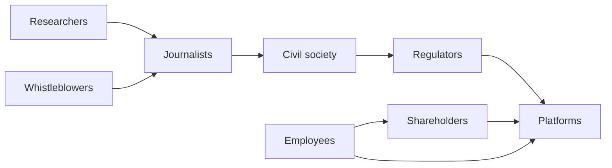

Attention, Substance, and the AI Moment · Part 6

Laws move slowly. A bill can take years to become a rule, and a rule can take years to become enforced behavior. In the meantime, the design of attention extraction keeps changing. That gap between regulatory pace and platform speed is why public pressure and internal accountability matter. They do not replace regulation, but they can make the problem visible before the law catches up.

This article looks at the actors who expose, translate, and amplify platform harms: academic researchers, investigative journalists, whistleblowers, employees, shareholders, and civil-society groups. Each plays a different role, and none is sufficient alone. Together they form an informal accountability ecosystem that keeps the pressure on.

<h2 id="when-research-runs-ahead-of-regulators">When Research Runs Ahead of Regulators</h2>

Much of what policymakers now treat as common knowledge first arrived through peer-reviewed research. Studies on problematic use, sleep disruption, anxiety, and political polarization preceded most legislative hearings by years. Claim C1 Platforms often responded by disputing causality, limiting data access, or pointing to user choice. The research did not by itself change corporate incentives, but it created a factual floor that later actors could stand on.

The pattern is not unique to technology. Public-health research on tobacco, automobiles, and processed foods similarly ran ahead of regulation. The difference today is velocity. A feed algorithm can be updated globally in hours, while a longitudinal study takes months or years. That asymmetry makes it especially important that research institutions retain independent access to platform data and publish findings even when they are inconvenient.

<h2 id="the-leverage-of-whistleblowers-and-reporters">The Leverage of Whistleblowers and Reporters</h2>

When internal documents leave a company, they can compress years of academic inference into a few days of public debate. Leaked materials can show not only that a harm exists, but that people inside the company measured it, discussed it, and sometimes chose not to act. Claim C2 Investigative journalism then translates those documents into narratives that regulators, shareholders, and ordinary users can understand.

The effect is not always a new law. Sometimes it is a design change, a congressional hearing, a stock movement, or simply a shift in what users believe about the platform. Each of these changes the cost-benefit calculation inside the company. Even a small increase in reputational or legal risk can make an internal advocate more persuasive when they argue for a safer default.

*The informal accountability ecosystem around platforms: research and leaks feed journalism and civil society, which in turn shape regulatory and public pressure, while employees and shareholders apply pressure from inside. Based on documented cases such as the Facebook Papers, Reuters Institute reporting, and Indian civil-society advocacy.*

<h2 id="pressure-from-inside-and-outside-the-boardroom">Pressure From Inside and Outside the Boardroom</h2>

Employees are another underused lever. Engineers, researchers, and policy staff often see problems before executives do. Organized internal pressure—petitions, open letters, walkouts, or resignations—can force leadership to respond faster than an external campaign alone. Claim C3 Shareholders add a second channel. When advocacy is framed as business risk—regulatory exposure, brand damage, talent retention—investors who might ignore an ethical argument will listen to a risk argument.

Both forms of pressure are limited. Employee organizing can be met with retaliation or confidentiality rules. Shareholder activism is most effective when it aligns with financial returns. But within those limits, internal and external pressure can accelerate changes that would otherwise wait for a regulatory deadline.

<h2 id="from-findings-to-public-demand">From Findings to Public Demand</h2>

Research, leaks, and employee concerns rarely become policy on their own. Civil-society organizations translate technical findings into campaigns, public-interest litigation, model legislation, and voter-facing language. Claim C4 In India, groups like the Centre for Internet and Society and the Internet Freedom Foundation have turned platform-governance questions into public debates, often ahead of formal regulatory action.

Campaigns do not always succeed, and they can be captured by partisan framing. But they perform a necessary function: they turn expert knowledge into public demand. A regulator is more likely to act when there is a visible constituency asking for action. A platform is more likely to change when its users understand what is at stake.

<h2 id="what-this-article-does-not-claim">What This Article Does Not Claim</h2>

This article does not argue that public pressure can replace law. Regulation remains essential for setting floors on data protection, transparency, competition, and user rights. Nor does it claim that every leak, campaign, or shareholder resolution is well-founded. Informal accountability can be noisy, partisan, or inaccurate. The point is only that, in the gap between platform speed and legal speed, these actors provide some of the most effective checks available.

<h2 id="sources-and-method">Sources and Method</h2>

This article draws on documented cases of platform accountability, including the Facebook Papers whistleblower disclosures, the Reuters Institute's work on digital news and platform trust, and the research and advocacy of Indian civil-society organizations such as the Centre for Internet and Society. It also refers to general patterns in academic research on social-media harms and in business-risk activism. Specific claims about causality are avoided where underlying evidence is correlational or contested.

<h2 id="related-in-this-series">Related in This Series</h2>

- [User Migration and the Exit Problem](/articles/user-migration-and-the-exit-problem/) — why leaving a dominant platform is harder than it looks, and what interoperability could change.
- [Friction, Chronological Feeds, and User-Chosen Algorithms](/articles/friction-chronological-feeds-user-chosen-algorithms/) — design interventions that can reduce extraction without waiting for regulation.
- [Business Models That Reward Substance](/articles/business-models-that-reward-substance/) — how alternative revenue models can align platform incentives with quality.
- [Attention, Substance, and the AI Moment](/articles/attention-substance-ai-moment/) — the full series guide and reading paths.
