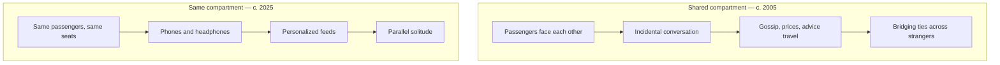

Step into a Mumbai local at rush hour, a Bengaluru metro carriage, or a bus stop in a small-town market. A decade ago these places hummed with argument, gossip, card games, and the accidental conversations that strangers fall into when they are packed together with nothing else to do. Today the same bodies are present, but the hum has changed. It is quieter, more fragmented, and directed inward. The shared physical space has not disappeared; it has been redecorated as a collection of private screens.

This is not a complaint about technology. Phones make travel safer, especially for women; they let workers call home, students revise notes, and migrants stay in touch across great distances. The question is what else they crowd out. When every idle minute is captured by a feed, the public realm loses something it once did cheaply: it stops producing encounters between people who would otherwise never meet.

Claim C1 Mass-media participation is nearly universal in India, while voluntary social participation has fallen sharply.

<h2 id="the-commute-is-not-empty">The Commute Is Not Empty</h2>

The idea that a commute is "wasted time" is itself a recent invention. For most of human history, movement between places was also social time. The Indian railway compartment was a classic example: a few hours of enforced proximity turned fellow passengers into temporary neighbours. You learned which crops were failing in a distant district, which coaching centre was worth the fee, which politician had just been caught in a scandal. Much of this was noise, but some of it was the low-cost circulation of knowledge that markets and classrooms could not reach.

The NSSO Time Use Survey 2024 captures the structural shift. It finds that **93% of Indians aged 6 and above participate in mass media or leisure activities**, and that leisure time has risen about 15% since 2019. The same survey records a very different story for voluntary, face-to-face social participation: attendance at community meetings, neighbourhood groups, and collective work has been declining. The time has not vanished; it has migrated from shared public life to individualized media consumption.

Claim C2 Public transit and waiting spaces in India show high rates of individual screen use across income groups.

There is no nationwide census of what commuters do on their phones, but the pattern is visible enough that any regular traveller can verify it. Metro carriages fill with bowed heads. Tea-stall queues are spent scrolling. Even two-wheeler riders paused at signals reach for their devices. Cheap data and cheap devices have made this behaviour cut across income groups in a way that earlier forms of portable entertainment — newspapers, Walkmans, handheld games — did not. The screen is no longer a class marker; it is a default posture.

*Diagram: the same physical compartment produces very different social outputs depending on whether attention is shared or privatized.*

*Accessible description: The flowchart compares a train compartment around 2005 and 2025. In the earlier panel, passengers facing each other talk, allowing news, prices, and recommendations to spread and creating weak ties across strangers. In the later panel, the same passengers in the same seats are absorbed by phones and headphones, consuming personalized feeds and producing what the article calls parallel solitude.*

<h2 id="what-disappears-when-everyone-looks-down">What Disappears When Everyone Looks Down</h2>

The loss is easy to romanticize, so it is worth describing precisely. Public spaces used to be places where people learned to read strangers: how to start a conversation, how to defuse tension, how to recognize distress or opportunity in a face rather than a profile. These skills are not innate; they are practised in repeated, low-stakes encounters. A child who never sees adults talk to strangers on a train grows up with a thinner model of public life than one who does.

Claim C3 Incidental conversation in public spaces historically served as a low-cost channel for information, apprenticeship, and social cohesion.

Robert Putnam's *Bowling Alone* documented the decline of American civic participation and the social capital that comes with it. Ray Oldenburg's idea of the "third place" — a social setting neither home nor work — captures what is at stake in the Indian context too: the tea stall, the park bench, the shared bench at a railway platform. These are not merely places to pass time. They are where people from different classes, castes, and professions share space long enough to discover common interests. When such spaces become collections of isolated users, the bridging ties that connect different social worlds weaken.

<h2 id="parallel-solitude">Parallel Solitude</h2>

Headphones are the architectural detail of this transformation. They turn a shared acoustic space into a private one. A 2015 Pew Research Center study on mobile etiquette found that **23% of cellphone owners in the United States said they used their phones in public specifically to avoid interacting with others**. The Indian equivalent is less surveyed but no less observable: the white wired earphones on a metro, the Bluetooth neckband on a bus, the phone held at chest height in a queue. Each is a small declaration that the surrounding social world is not welcome.

Claim C4 Headphones and private feeds convert shared space into parallel solitude, making social withdrawal feel like a norm.

The design of feeds reinforces this. They are infinite, personalized, and engineered to make the next swipe more rewarding than the person standing nearby. The result is what Sherry Turkle called "alone together": bodies in proximity, attention in separate worlds. A train compartment becomes a room of parallel solitudes, each passenger in a bespoke entertainment economy. The withdrawal is not antisocial in intent; for many it is a relief from crowding, heat, and the labour of social performance. But when it becomes the default, it changes what public space is for.

<h2 id="what-this-article-does-not-claim">What This Article Does Not Claim</h2>

It does not claim that every commuter should talk to every stranger. Safety, rest, and personal boundaries matter, especially in crowded public spaces. It does not claim that phones caused the decline of community life by themselves. Urbanization, changing work patterns, migration, and the erosion of older neighbourhood structures all play a part. And it does not claim that digital connection is fake while physical connection is real. For many Indians, WhatsApp groups and video calls are the threads that keep families and communities intact across distance.

What it does claim is that there is an opportunity cost. The same hour on a train can be spent consuming a feed or it can be spent in the unplanned, often inefficient social contact that builds civic trust. A country that loses the habit of incidental encounter loses a cheap but powerful form of social infrastructure. Apps can simulate community; they cannot fully replace the accidental apprenticeship that happens when a teenager watches a mechanic argue with a customer, or when a student overhears two professionals discussing their work.

<h2 id="sources-and-method">Sources and Method</h2>

This article draws on government survey data (NSSO Time Use Survey 2024), sociological framing (Robert Putnam's *Bowling Alone*, Ray Oldenburg's "third place" concept), and a Pew Research Center study on mobile etiquette. Much of the Indian public-space observation is experiential and widely reproducible rather than systematically quantified. Where nationwide data is absent, the text says so. The argument is structural and cautionary, not causal in the strict sense.

<h2 id="related-in-this-series">Related in This Series</h2>

- [By the Numbers: What Indians Actually Do Online](/articles/by-the-numbers-what-indians-do-online/) — the quantitative backdrop to the diagnosis.
- [The Reel Nation: Short-Form Video and the Economics of a Swipe](/articles/the-reel-nation-short-form-video/) — how feed design captures the minutes that once belonged to public life.
- [The Student Screen](/articles/the-student-screen-education-vs-entertainment/) — how adolescents split their attention between education and entertainment.
- [Attention, Substance, and the AI Moment](/articles/attention-substance-ai-moment/) — the full series guide and reading paths.
