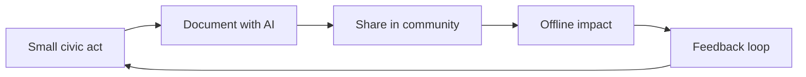

Attention, Substance, and the AI Moment · Part 4

Most civic problems in India are not waiting for a genius inventor. They are waiting for someone to explain things clearly, in the right language, at the right time, and then share that explanation with ten neighbors. A pension scheme no one understands. A drain that floods every monsoon. A vaccination schedule that arrives as a poster no one can read. These are information problems more often than money problems. And information problems are exactly where a citizen with a phone and a little help from AI can begin.

Claim C1 Government schemes, health information, and civic services are often inaccessible not because they do not exist, but because of language barriers, formal language, and fragmentation across offices, apps, and deadlines.

The citizen's garden is the idea that civic substance can be built in small, repeated acts. Translate one scheme into the local language. Record a two-minute voice note explaining how to fill a form. Pin a neighborhood map to a WhatsApp group. Verify a clinic's hours and pass the correction along. None of these acts is heroic. Each one lowers the friction between a public good and the people it is meant to serve. Done often enough, they become local infrastructure.

<h2 id="why-the-first-step-is-so-hard">Why the First Step Is So Hard</h2>

India's public systems produce an enormous amount of information. Scheme guidelines, health advisories, election rolls, ration-shop rules, school admission forms, building permissions. Much of it is written in English or in formal Hindi that does not match how people actually speak. It is scattered across websites, PDFs, notice boards, and overworked officials. For a rural user, a first-generation internet user, or someone with limited schooling, the cost of understanding can be higher than the cost of traveling to the office.

This is where attention extraction and civic neglect overlap. The same phone that delivers entertainment in every dialect often fails to deliver useful public information in any dialect. The feed is effortless; the form is exhausting. The result is that millions of people remain eligible for benefits they never claim, aware of problems they do not know how to report, and surrounded by schemes they cannot navigate.

The gap is not only digital. It is also social. Trust in official information is often low, especially among communities that have experienced bureaucratic indifference. A government poster is one thing. The same information, explained by a neighbor who has already used it, is another.

<h2 id="what-ai-changes">What AI Changes</h2>

Claim C2 AI translation, summarization, and voice generation can lower the cost of turning complex official information into local, spoken, shareable knowledge.

India's Bhashini platform is a public attempt to make this real. It provides AI models for translation, speech recognition, and text-to-voice across many Indian languages. The goal is not perfect literary translation; it is functional communication. A citizen can take a scheme guideline, translate it into Kannada or Bhojpuri or Tamil, and then record or generate a voice version for a group that prefers listening to reading.

The technology is not magic. Machine translation still struggles with legal phrasing, local idioms, and context. A translated form can be wrong in ways that matter. But it can also be good enough to start a conversation, and good enough is often the missing step. A neighbor who receives a rough translation can ask a follow-up question. A volunteer who sees a summary can check it against the original. The AI produces the first draft; the community produces the accuracy.

Voice is especially important. Many Indian internet users are more comfortable speaking and listening than reading long documents. Text-to-speech and speech-to-text tools can turn a dense PDF into a two-minute audio message. That changes who can participate. A literate teenager is no longer the only gateway between the state and the household.

<h2 id="why-humans-remain-essential">Why Humans Remain Essential</h2>

Claim C3 Local volunteers, community organizations, and trusted neighbors remain essential for trust, verification, and last-mile delivery.

AI can generate an explanation. It cannot generate trust. A villager is more likely to believe a scheme works if someone from her own community has already used it. A parent is more likely to vaccinate a child if the local health worker explains it in person. A resident is more likely to report a drain if he knows the municipal councilor's office actually reads complaints.

This is why the citizen's garden depends on intermediaries: the anganwadi worker, the schoolteacher, the ration-shop dealer, the self-help group leader, the young person who translates for elders. These people already have attention and trust. AI gives them a sharper tool. But the tool is useless without the relationship.

Verification matters too. A translated summary that misstates an eligibility rule can waste someone's day or cost them a benefit. The best local knowledge networks include a feedback loop: readers correct the explainer, the explainer updates the note, and the corrected version travels further. The network learns faster than any single AI model because it is anchored in real experience.

<h2 id="small-acts-compound">Small Acts Compound</h2>

Claim C4 Small civic acts—translated, documented, and shared—can compound into neighborhood-level infrastructure that outlasts the person who started them.

One good explanation is a seed. If it is saved, forwarded, and refined, it becomes a tree. A WhatsApp group that collects verified local information becomes a public good. A shared spreadsheet of clinic timings becomes a reference. A neighborhood flood map, updated each monsoon, becomes institutional memory.

The compounding is not automatic. It requires habits: document what you learn, share it in a findable place, and let others improve it. Open Government Partnership's civic-tech guidance emphasizes that successful civic tools are rarely one-off apps; they are sustained relationships between citizens, civil society, and government. The technology is the easy part. The persistence is the hard part.

*How a small civic act can scale: AI lowers the cost of documentation, community sharing creates trust and reach, and offline impact feeds back into new acts. Based on Bhashini and Open Government Partnership civic-tech guidance.*

There are also limits. A citizen cannot fix a broken drainage system with a translated poster. AI does not replace budgets, engineering, or political will. But information is often the first domino. When people know what they are entitled to, they are more likely to ask for it. When they can name the responsible office, they are more likely to hold it accountable. The garden grows in the direction of attention and effort.

<h2 id="sources-and-method">Sources and Method</h2>

This article draws on the Bhashini platform documentation, the Open Government Partnership civic-tech guidance, and the broader literature on Indic-language AI and civic technology. It also builds on the series-wide use of Indian digital-access data from IAMAI-Kantar and NCAER IHDS Wave 3. The examples are illustrative rather than case-study-specific; the argument is that the barrier to civic participation is often informational, and that AI-assisted translation and explanation can lower it when paired with human trust networks.

<h2 id="open-questions">Open Questions</h2>

- How can citizen-produced local knowledge be verified without creating new gatekeepers?
- What incentives would encourage more people to maintain civic information as a repeated practice?
- How should government bodies respond to citizen-generated translations and corrections?
- Can small civic acts scale without losing the trust that makes them effective?

<h2 id="related-in-this-series">Related in This Series</h2>

- [The Substance Builder](/articles/the-substance-builder/) — the broader idea of turning small acts of attention into skill and civic contribution.
- [Bhashini and the Indic-Language AI Moment](/articles/bhashini-and-the-indic-language-ai-moment/) — how Indic-language AI could shift content from entertainment-first to knowledge-first.
- [A Map of Levers](/articles/a-map-of-levers/) — who can pull which levers to shift India's attention economy toward substance.
- [Designing for Substance](/articles/designing-for-substance/) — how platform design could make substance the easier path.
- [Attention, Substance, and the AI Moment](/articles/attention-substance-ai-moment/) — the full series guide and reading paths.
