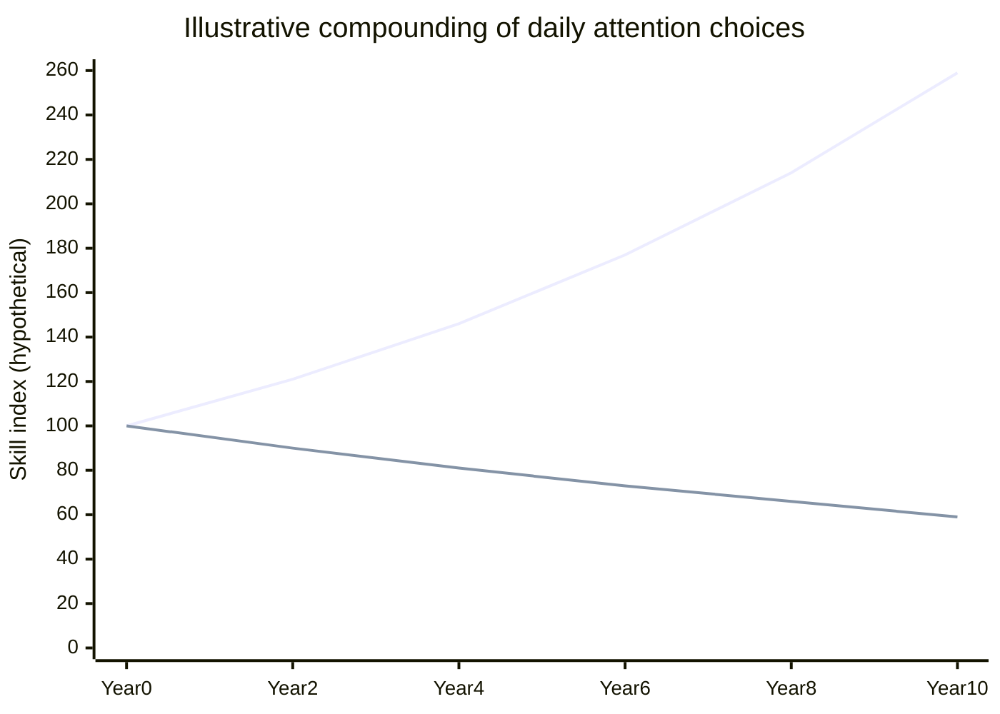

Attention, Substance, and the AI Moment · Part 3

India's AI moment is usually described as a technology race: more chips, more models, more startups, more funding. That story is not wrong, but it is incomplete. The country already has much of what the technology story requires — a large young population, deep software talent, cheap data, and a government mission spending more than ₹10,000 crore on AI infrastructure. The scarcer resource is sustained attention.

Claim C1 India's AI opportunity is not mainly a technology or capital problem; it is a compounding attention problem whose payoff depends on whether millions of small daily choices tilt toward learning, creation, and deep work.

This article steps back from the headline numbers of AI investment and asks a quieter question: if AI makes creation cheap but distraction cheap too, what determines which side wins?

<h2 id="the-cost-collapse-is-real">The Cost Collapse Is Real</h2>

Artificial intelligence has lowered the floor for many kinds of creation. A student can ask a language model to explain a concept in her mother tongue and generate practice questions. A young engineer can prototype an idea over a weekend. A teacher can prepare differentiated material for mixed classrooms.

Claim C2 Generative AI has collapsed the cost of first drafts, first prototypes, first translations, and first tutoring sessions, which makes individual creation less dependent on institutional gatekeepers than it was even five years ago.

The evidence is cross-border. The OECD's 2025 review finds early productivity gains in writing, coding, customer service, and some professional tasks, with the largest gains for workers who use the tool inside a structured workflow. Stanford HAI's 2025 AI Index reports AI coding performance on SWE-bench rose from 4.4% in 2023 to 71.7% in 2024. The Stanford Global AI Vibrancy Tool 2025 ranks India third globally, behind only the United States and China, on a composite of research, talent, economy, policy, infrastructure, and adoption.

But capability on paper is not the same as capability in practice. The same tool that lowers the cost of building also lowers the cost of watching, scrolling, and simulating work without doing it.

<h2 id="the-readiness-is-strong-the-attention-is-weak">The Readiness Is Strong; The Attention Is Weak</h2>

India's AI readiness is not in doubt. NASSCOM's AI Adoption Index 2.0, produced with EY, surveyed 500 companies across seven sectors covering roughly three-quarters of India's GDP. It places India's aggregate AI maturity at the "enthusiast" stage with a score of 2.47 on a four-point scale, up from 2.45 in 2022. Eighty-seven percent of companies are in middle "enthusiast" or "expert" stages, and the expert-stage share has doubled since 2022. A separate NASSCOM-BCG analysis projects India's AI market growing at 25–35% annually to reach $17 billion by 2027.

Claim C3 India's AI readiness is strong on talent, enterprise intent, and policy infrastructure, but weak on the sustained attention and deep-work habits required to convert access into productive capability at scale.

The weakness shows up in the workplace. Gallup's State of the Global Workplace 2026 report, covering data collected in 2025, places India's employee engagement at 23% — a seven-point drop and the lowest figure since 2020. Fifty-nine percent of Indian employees are "not engaged," and 18% are "actively disengaged." Gallup estimates low engagement costs India roughly $351 billion annually.

Engagement is shaped by wages, management, job quality, and macro conditions, not only by phones and feeds. But a psychologically checked-out workforce is unlikely to absorb AI's productivity gains automatically. AI magnifies the prepared mind; it does not create one from a distracted one.

<h2 id="the-compounding-curve">The Compounding Curve</h2>

The central idea is compounding. Small daily choices about attention do not feel decisive on any given day. An hour spent learning versus an hour spent scrolling is just one hour. But over years the difference between the two paths widens dramatically.

*The chart above is illustrative, not empirical. The exact rates are arbitrary; the shape is the point.*

*Accessible description: The line chart shows two hypothetical paths over ten years. One line starts at a skill index of 100 and compounds upward to roughly 259, representing small daily learning choices. The other line starts at 100 and declines to roughly 59, representing daily attention diverted to distraction. The shape, not the exact numbers, is the point.*

Claim C4 Small daily choices about attention compound over years into large differences in individual skill; multiplied across a young population, those differences become differences in national capacity.

The student who uses AI to interrogate an idea builds a mind. The student who uses it to finish homework builds a transcript. The worker who spends a commute learning builds a skill stack. The worker who spends it scrolling builds a tolerance for boredom. The parent who is present teaches attention by example. These differences are slow and uneven, which is why they are easy to dismiss in the moment. They are also why they matter.

National capacity is individual capacity added up and connected. A country with millions of people who know how to use AI to learn, build, and solve problems will produce more innovation, better public services, and stronger institutions than a country with the same tools but a population trained mainly to consume.

<h2 id="where-the-bet-is-made">Where the Bet Is Made</h2>

The compounding bet is not made in boardrooms. It is made in ordinary places.

**In the classroom.** ASER 2024 found that 76% of 14–16-year-olds use smartphones for social media while 57% use them for education. What a teenager learns about attention in these years becomes the default she brings to work and family.

**In the workplace.** The average Indian knowledge worker faces an interruption economy. Microsoft research and related studies estimate around 275 interruptions per workday and a 23-minute recovery cost after each one. A worker surrounded by notifications cannot enter the deep states where AI's creative gains are realized.

**In the household.** Children do not mainly do what parents say; they do what parents do. A household of scrollers will raise scrollers even if the parents lecture against screens. The first intervention is the adult's own attention habit.

Claim C5 The compounding bet is made in three ordinary arenas — schools, workplaces, and households — where the same AI tools can either deepen focus or deepen distraction depending on default habits and environmental design.

<h2 id="what-could-tilt-the-curve">What Could Tilt the Curve</h2>

The habit problem is not only an individual problem. The environment shapes the habit.

**Education.** If schools treat phones only as distractions, they cede the most important learning device to platforms that do not share their goals. The alternative is to teach attention as a skill: how to set an intention, evaluate a source, persist through confusion, and use AI as a tutor rather than a shortcut.

**Workplace design.** Deep work requires protected time. Teams that batch notifications, reduce meetings, and protect focus blocks give AI-assisted workers a chance to use the tools well.

**Platform incentives.** The creator economy rewards what keeps users watching. BCG's mapping of India's creator economy shows monetization heavily tied to reach and engagement, with income concentrated at the top. A substance-oriented metric would not eliminate entertainment; it would make depth legible enough to survive. Regulation, public pressure, and alternative business models can nudge the reward function, as discussed in [Designing for Substance](/articles/designing-for-substance/).

Claim C6 Public policy, platform design, and education can tilt the compounding curve toward substance, but no single lever is sufficient; the curve bends only when individual habit and systemic design move together.

<h2 id="the-historical-pattern">The Historical Pattern</h2>

There is nothing inevitable about this. History is full of societies that gained access to a powerful general-purpose technology but failed to build the habits and institutions that turned access into advantage.

The printing press spread across Europe, but the regions that gained most built schools, universities, scientific societies, and habits of public argument. The personal computer entered homes worldwide in the 1980s and 1990s, but the households that prospered learned to compose, analyze, and build. Societies that treated these machines mainly as new forms of consumption kept paying rent to the ones that created.

Claim C7 Historical analogies suggest that societies which build creation habits around a new general-purpose technology tend to gain more than societies that treat it mainly as a consumption device, though colonial, capital, and institutional advantages mean the analogy is a shape, not a guarantee.

AI is not a printing press or a PC. It is a general-purpose tool that makes other tools cheaper. The recurring pattern is what matters: the benefit goes to the prepared mind, and preparation is a habit formed daily.

<h2 id="sources-and-method">Sources and Method</h2>

This article draws on workplace research (Gallup State of the Global Workplace 2026, published April 2026 with data collected January–December 2025), Indian enterprise AI research (NASSCOM-EY AI Adoption Index 2.0, 2024; NASSCOM-BCG projections of India's AI market), international AI benchmarking (Stanford HAI AI Index Report 2025 and Global AI Vibrancy Tool 2025), economic analysis of generative AI (OECD 2025), Indian education data (ASER 2024), and the government's AI infrastructure push (IndiaAI Mission). Where figures are projections, benchmarks, or global comparisons applied to India, the text says so. The compounding curve is illustrative, not empirical.

<h2 id="open-questions">Open Questions</h2>

- How much of India's engagement decline is reversible through workplace design, and how much reflects deeper issues of job quality and wages?
- Can schools teach attention as a skill without making technology the enemy?
- What would a substance-oriented creator-economy metric look like in practice?
- Which AI-assisted workflows have shown sustained, measured productivity gains in Indian organizations?
- How should public investment in AI infrastructure be balanced with investment in the human habits needed to use it well?

<h2 id="related-in-this-series">Related in This Series</h2>

- [The Generational Bet](/articles/the-generational-bet/) — the stakes: will India build the AI age or scroll through it?
- [The Attention Extraction](/articles/the-attention-extraction/) — the diagnosis of attention extraction in India.
- [By the Numbers: What Indians Actually Do Online](/articles/by-the-numbers-what-indians-do-online/) — the data behind the entertainment-to-education gap.
- [The Substance Builder](/articles/the-substance-builder/) — practical paths for turning dead time into small acts of creation.
- [Designing for Substance](/articles/designing-for-substance/) — how platforms, metrics, and policy could make substance the easier path.
- [Attention, Substance, and the AI Moment](/articles/attention-substance-ai-moment/) — the series guide and reading paths.
