Attention, Substance, and the AI Moment · Part 21

India is young. That fact is repeated in budget speeches, investor decks, and startup pitch meetings. A young population is supposed to mean a larger workforce, more consumers, faster growth, and a demographic dividend that lifts the country for decades. But the dividend is not automatic. It depends on what those young people do with their time.

Claim C1 Roughly 65% of India's population is under 35, giving it one of the world's youngest workforces.

<h2 id="the-scale-of-the-youth-bulge">The Scale of the Youth Bulge</h2>

India's median age is around 28, and roughly two-thirds of its people are below 35. That is not just a statistic; it is a structural fact. For the next several decades, India will have more working-age adults relative to dependents than most major economies. China aged first and grew rich. India is growing while it is still young.

The window is large, but it is not permanent. Populations age. Skills depreciate. The question is whether the country converts this youth bulge into productive capacity before the bulge passes.

```mermaid
xychart-beta
    title "India's age structure: 2024 vs 2050 (illustrative % shares)"
    x-axis [0-14, 15-24, 25-34, 35-44, 45-54, 55-64, 65+]
    y-axis "Share of population (%)" 0 --> 35
    bar [26, 17, 16, 13, 10, 8, 10]
    bar [18, 13, 14, 14, 13, 12, 16]
```

*Source: World Bank and UN population estimates; 2024 figures reflect published age-structure data and 2050 figures are illustrative projections. The first bar series (taller left side) represents 2024; the second bar series represents 2050.*

The pyramid shows the shape of the opportunity. The base is wide. The challenge is turning that width into depth: depth of skill, depth of learning, depth of problem-solving.

<h2 id="the-skills-gap">The Skills Gap</h2>

Youth alone does not create prosperity. Employers need people who can do useful work, and the evidence suggests a persistent gap between what graduates know and what employers need.

Claim C2 India Skills Report and other surveys find employability rates below 55% for many graduate cohorts.

The India Skills Report 2025 finds that only about half of surveyed graduates are considered employable in the current market. NASSCOM's talent gap estimates point in the same direction: demand for digital and technical skills is outpacing supply, and the gap is especially pronounced in emerging areas such as artificial intelligence, data science, and cybersecurity.

This is not a failure of individuals. It is a mismatch between how time is spent in education and what the labor market rewards. Degrees accumulate; capabilities do not always follow. The same years that could be spent building depth in a valuable skill are often spent clearing exams, chasing credentials, or, increasingly, scrolling through feeds.

<h2 id="youth-unemployment-and-the-graduate-paradox">Youth Unemployment and the Graduate Paradox</h2>

If a young workforce were enough, youth unemployment would be low. It is not. India's overall unemployment rate has improved in recent years, but youth unemployment remains elevated, and the problem is often worse among the more educated.

Claim C3 Youth unemployment, especially among graduates, is elevated relative to overall unemployment.

This is the graduate paradox: more schooling does not always lead to more work. The Periodic Labour Force Survey and related government data show that unemployment is concentrated among younger workers and among those with higher secondary or graduate degrees in some years. The reasons include a shortage of formal jobs, a mismatch between training and industry needs, and the queueing effect — young people staying in education longer while waiting for better opportunities.

The opportunity cost is enormous. Every year that a young graduate spends underemployed or unemployed is a year of skill formation lost. In a fast-moving technological transition, that loss compounds.

<h2 id="the-time-use-dividend">The Time-Use Dividend</h2>

Which brings the argument back to attention. The demographic dividend is not really a population dividend. It is a time-use dividend.

Claim C4 The demographic dividend is therefore a time-use dividend: the same years can build human capital or be absorbed by low-value screen activity.

The same young person can spend an evening learning a programming language, practicing a trade, or reading about a civic problem — or can spend it in an infinite scroll of short videos designed to maximize engagement. The platform does not care which choice is better for the country. Its incentive is to maximize time on site. The country's incentive is to maximize human capital.

Those two incentives are not perfectly aligned. In fact, they often point in opposite directions. The attention economy extracts time from the very population that India needs to invest in itself.

This does not mean entertainment is the enemy. Rest, play, and social connection matter. But the ratio matters. When low-value screen activity absorbs a large share of disposable youth attention, the dividend shrinks.

<h2 id="what-would-make-the-dividend-automatic">What Would Make the Dividend Automatic?</h2>

Nothing makes it automatic. Policy can improve schools and vocational training. Employers can invest in apprenticeships. Platforms can design for time well spent instead of time harvested. Families and individuals can protect deep-work hours and sleep. Each lever helps, but none is sufficient alone.

The honest framing is that India has a window, not a guarantee. The window is filled with young people who have cheap internet, cheap devices, and more content than any generation before them. Whether that combination produces a skilled workforce or a distracted one is still being decided, one hour at a time.

<h2 id="related-in-this-series">Related in This Series</h2>

- [By the Numbers: What Indians Actually Do Online](/articles/by-the-numbers-what-indians-do-online/) — the data on how India's digital time is spent across entertainment, education, work, and communication.
- [The Generational Bet](/articles/the-generational-bet/) — whether India will build the AI age or scroll through it.
- [What India Is Building vs. What It Could Build](/articles/what-india-is-building-vs-could-build/) — how capital and talent are flowing toward convenience rather than deep tech.
- [A Map of Levers](/articles/a-map-of-levers/) — who can pull which levers to redirect attention toward substance.

<h2 id="sources-and-method">Sources and Method</h2>

This article draws on government data and press releases (PIB youth statistics, Periodic Labour Force Survey), industry reports (India Skills Report 2025, NASSCOM talent demand-supply estimates), and international population estimates (World Bank, UN population data). Figures on employability and youth unemployment are survey-based and vary by methodology; the text flags the key uncertainties. Causal claims are avoided where the underlying evidence is correlational.

<h2 id="open-questions">Open Questions</h2>

- How much of India's youth unemployment is cyclical, and how much is structural?
- Which skill-building interventions have measurable effects on employability at scale?
- How does low-value screen time displace formal learning versus informal skill acquisition?
- What policies or platform designs could tilt youth attention toward human-capital formation?
