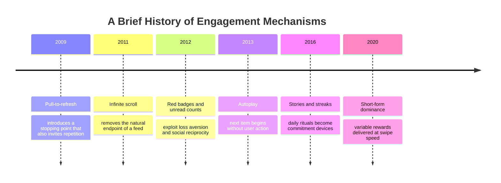

Most people who open a short-form video app do not decide, in any deliberate sense, to spend the next forty minutes there. They decide to watch one clip. Then another. Then the app decides for them. By the time they look up, the train stop has arrived, the coffee is cold, or the hour set aside for study has disappeared.

This is not because users are weak. It is because the product is designed to make leaving harder than staying. The mechanisms are not secret. They are catalogued in design books, exposed by former product engineers, and studied by researchers who compare feeds to slot machines. Claim C1 The variable-ratio reward schedule that makes gambling machines compulsive is also central to feed design: the next swipe might be boring, funny, useful, or outrageous, and the uncertainty itself keeps the finger moving.

<h2 id="the-removal-of-stopping-points">The Removal of Stopping Points</h2>

A well-designed tool gives you a place to stop. A book ends a chapter. A film runs credits. A conversation pauses when nobody has anything left to say. Many attention platforms do the opposite. They remove the cues that tell a user, "This is a natural endpoint."

Infinite scroll means the next item loads before the current one is finished. Autoplay starts the next video without asking. Pull-to-refresh promises that something newer might have arrived since the last pull. Claim C2 Each of these patterns removes friction from consumption and removes a stopping point from the experience, making it easier to continue than to choose otherwise. The design does not force anyone to stay, but it tilts the architecture of choice toward staying.

*Timeline of widely documented engagement techniques. Dates are approximate and mark when each pattern became dominant in consumer products; sources include design literature and public product retrospectives.*

This matters at scale. India alone has hundreds of millions of users on short-form video, messaging, and social feeds. A few extra seconds per session, multiplied across that user base, becomes billions of additional hours. The platforms measure this. Session length, opens per day, and time-to-return are core metrics. The product is optimised for them.

<h2 id="the-return-triggers">The Return Triggers</h2>

If variable rewards keep users inside a feed, notifications and streaks pull them back in once they leave. A red dot suggests something unread. A push notification frames a message as urgent even when it is not. A streak counter warns that a daily ritual will be broken if the app is not opened today.

Claim C3 These cues exploit well-documented psychological tendencies: loss aversion makes unread badges feel like small debts; social reciprocity makes message alerts hard to ignore; streaks convert an optional habit into a commitment device that feels costly to break. Again, none of this is hidden. It is the explicit subject of persuasive-design literature and the dark-patterns taxonomy used by regulators and consumer advocates.

Users are not passive. Many turn off notifications, set timers, or delete apps for stretches of time. But the default is powerful because it shapes the behavior of users who never change a setting. The design choice is made once by the product team; the friction is felt billions of times by users.

<h2 id="design-is-a-choice-not-a-force-of-nature">Design Is a Choice, Not a Force of Nature</h2>

It is common to describe heavy phone use as a cultural trend, a generational trait, or the inevitable result of cheap data. Those factors matter, but they do not explain why one feed uses autoplay and infinite scroll while another does not. They do not explain why some apps default to chronological order and others default to algorithmic ranking. They do not explain why a notification can be silent, bundled, or turned off by default.

Claim C4 The extraction patterns are product decisions. They can be documented, compared, regulated, and redesigned. Chronological feeds, default-off notifications, friction before autoplay, and visible session timers are all technically possible. They are simply less profitable in a business model that sells attention to advertisers.

That last sentence is important. The design of extraction is not a failure of user discipline; it is the logical outcome of an attention-based business model. When revenue depends on time spent, the product will evolve toward whatever maximises time spent. The same engineering talent that built infinite scroll could build graceful exits. The question is who pays for the difference.

<h2 id="sources-and-method">Sources and Method</h2>

This article draws on public talks by former product ethicists, design literature on habit-forming products, the dark-patterns research corpus, and behavioural research on variable rewards and persuasive triggers. It uses design-pattern analysis rather than platform-internal data; no claim depends on access to proprietary algorithms or metrics. Causal language is avoided where the underlying evidence is analogical or correlational.

<h2 id="related-in-this-series">Related in This Series</h2>

- [The Reel Nation: Short-Form Video and the Economics of a Swipe](/articles/the-reel-nation-short-form-video/) — how variable-reward feeds extend sessions among India's short-form video users.
- [Sleep, Anxiety, and the Tele-MANAS Signal](/articles/sleep-anxiety-and-tele-manas/) — the mental-health load that notification-driven, always-on routines contribute to.
- [Engagement Is a Design Choice](/articles/engagement-is-a-design-choice/) — why ranking metrics and engagement targets are not inevitable.
- [Attention, Substance, and the AI Moment](/articles/attention-substance-ai-moment/) — the full series guide and reading paths.
