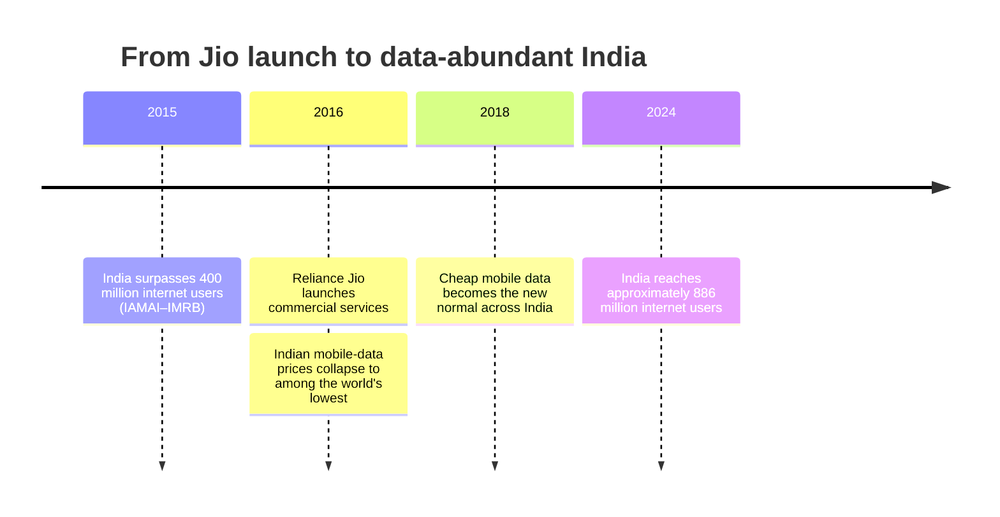

Attention, Substance, and the AI Moment · Part 17

In September 2016, Reliance Jio launched commercial services with free voice calls and data prices that undercut the market by an order of magnitude. Within months, India had gone from a data-scarce country to one where a gigabyte cost less than a cup of chai. The event is often celebrated as a digital-access miracle. Less discussed is what happened next: the same cheap data that connected hundreds of millions of people also built the runway for an attention-extraction economy on an unprecedented scale.

Claim C1 Jio's 2016 launch reduced Indian mobile-data prices to among the lowest in the world.

<h2 id="the-price-collapse">The Price Collapse</h2>

Before Jio, Indian mobile-data prices were already falling, but they were still a budget item for most households. Jio's entry turned data into a near-commodity. TRAI's performance indicators show that average revenue per user from data collapsed after 2016 as incumbents matched Jio's tariffs. The ITU's affordability reports consistently rank India among the cheapest countries for mobile broadband relative to income. By some measures, a gigabyte of mobile data in India became cheaper than in almost any other large market.

The price drop was not a marginal improvement. It was a phase transition. A resource that families once rationed became something they could leave on. Teenagers who previously waited for Wi-Fi could now stream on buses. Rural users who had never owned a data plan found themselves inside the same app economy as urban millennials. The infrastructure for a knowledge-first internet was in place. What arrived first was a consumption-first internet.

*Timeline of the Jio-era collapse in mobile-data prices and the subsequent expansion of India's internet user base. Sources: TRAI Performance Indicators Reports; IAMAI-Kantar Internet in India Report 2024.*

<h2 id="the-access-explosion">The Access Explosion</h2>

The numbers that followed are striking. India added hundreds of millions of internet users in the years after 2016, becoming the world's second-largest online population. The IAMAI-Kantar Internet in India Report 2024 describes a market where rural India drives much of the remaining growth and where smartphone adoption has pushed internet use deep into towns and villages that were barely online a decade ago.

Claim C2 India added hundreds of millions of internet users in the following years, many in rural areas and on low-cost smartphones.

This expansion is a genuine public good. Cheap data lowered the cost of government services, banking, telemedicine, education, and communication for people who had been priced out. It enabled entrepreneurs, activists, teachers, and students to reach audiences and tools that were previously inaccessible. Any honest account of the Jio effect must begin with this access dividend.

But access is a necessary condition, not a sufficient one. The same low-cost smartphone that delivers a lecture also delivers an infinite feed. The same data plan that connects a farmer to market prices connects a teenager to algorithmic entertainment designed to extend session length. The question was never whether India would get online. It was what the default use of that connection would become.

<h2 id="the-behavior-that-followed">The Behavior That Followed</h2>

The shape of Indian internet use after 2016 is well documented. Entertainment, social media, and messaging absorbed the largest share of time. Short-form video, in particular, grew from a niche format to a national pastime. Industry reports measured daily active users spending up to 45 minutes a day in 2020, with average use projected to reach 55–60 minutes by 2025. Gaming and messaging expanded in parallel, turning the smartphone into a portable theater, arcade, and gossip circle.

Claim C3 The same low-cost data enabled a surge in short-form video, gaming, and messaging.

This was not a coincidence. Platforms design for engagement because their business model rewards time spent. Autoplay, variable rewards, infinite scroll, and algorithmic recommendations are not accidents; they are the product of deliberate engineering. Cheap data removed the friction that once capped those designs. When every swipe is essentially free, the only limit on consumption is attention itself.

It is also not a uniquely Indian failing. The same design patterns operate in Brazil, Indonesia, Nigeria, and the United States. What makes India's case distinctive is the speed and scale of the transition. A country that added hundreds of millions of users in a few years did not have decades to develop the norms, institutions, and literacy that might have steered those users toward substance by default.

<h2 id="the-access-behavior-paradox">The Access-Behavior Paradox</h2>

The paradox at the heart of the Jio effect is that the infrastructure solved one problem while creating another. It solved access. It did not solve use. A student in a village with a cheap data plan has the same library in her pocket as a student in Mumbai, but the default apps on her home screen are not designed to take her to the library. They are designed to keep her in the feed.

Claim C4 The access success now raises a use question: can the same infrastructure be redirected toward productivity and learning?

This is why the Jio moment matters for the AI transition. Generative AI can lower the cost of tutoring, translation, coding help, and civic information in the same way that Jio lowered the cost of data. But the direction of that benefit depends on defaults and incentives, not on the technology itself. If AI is deployed primarily to make feeds more addictive and synthetic influencers more persuasive, the Jio pattern will repeat at a higher velocity. If it is deployed to make learning, creation, and local knowledge cheaper, the same infrastructure could finally pay the dividend it promised.

The historical lesson of 2016 is therefore double-edged. Access is powerful, but access without guardrails becomes extraction. The question for India now is not whether it can get online; it already has. The question is whether it can build the design norms, business models, and public habits that turn cheap data into deep capability rather than shallow consumption.

<h2 id="sources-and-method">Sources and Method</h2>

This article draws on telecom regulatory data (TRAI Performance Indicators Reports), international affordability benchmarks (ITU Affordability of ICT Services 2023), and internet-use estimates (IAMAI-Kantar Internet in India Report 2024). It also references industry analysis of short-form video growth in India (Bain: The Rise of Short-Form Video in India). Where figures are estimates or based on industry reports, the text says so. Causal claims about platform design and behavior are framed as correlations and structural incentives, not proven individual effects.

<h2 id="related-in-this-series">Related in This Series</h2>

- [By the Numbers: What Indians Actually Do Online](/articles/by-the-numbers-what-indians-do-online/) — the data portrait of India's digital time budget.
- [The Reel Nation: Short-Form Video and the Economics of a Swipe](/articles/the-reel-nation-short-form-video/) — how short-form feeds captured so much of the attention that cheap data released.
- [Historical Hinges: When Access to a Tool Did Not Guarantee Its Benefits](/articles/historical-hinges-access-is-not-benefit/) — why technology transitions often deliver access before they deliver benefits.
- [Attention, Substance, and the AI Moment](/articles/attention-substance-ai-moment/) — the full series guide and reading paths.
