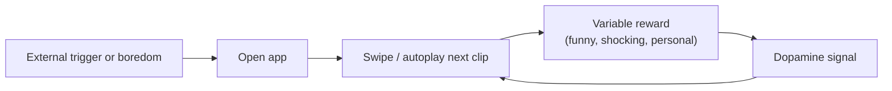

If you had to pick one activity that defines India's internet today, it would not be email, search, or online learning. It would be the short-form video feed. On trains, in tea shops, during homework breaks, and before sleep, millions of people swipe through a bottomless stream of clips. The behaviour looks like leisure. But the design behind it is closer to a slot machine: every swipe is a small bet on a rewarding outcome, and the house is built to keep you playing.

Claim C1 India has one of the world's largest short-form video user bases, with daily active users spending up to 45 minutes a day in 2020 and average use projected to reach 55–60 minutes by 2025.

<h2 id="the-scale-of-the-swipe">The Scale of the Swipe</h2>

India's short-form video audience is enormous by any measure. Industry estimates place active users in the hundreds of millions, and Bain's 2021 report on online video in India measured daily active users spending up to 45 minutes a day in 2020, with average use projected to reach 55–60 minutes by 2025. That is not fringe behaviour; it is a central feature of the country's digital life.

The growth has been driven by cheap data, Indic-language content, and affordable smartphones. A user in a small town can now watch, create, and share clips in her own language for a few rupees a day. The IAMAI-Kantar Internet in India Report 2024 documents how deeply short video has penetrated everyday use. But the numbers are also uneven. Industry averages hide wide variation: some users watch for a few minutes, others for several hours, and heavy use is concentrated among younger audiences. The averages tell us the scale; they do not tell us the distribution.

What matters is the shape of the attention budget. An hour a day per user, repeated across hundreds of millions of users, adds up to billions of hours every month. Those hours have to come from somewhere.

<h2 id="why-the-feed-never-stops">Why the Feed Never Stops</h2>

Short-form video is not addictive by accident. The interfaces are engineered around a few well-documented mechanisms: autoplay, infinite scroll, variable rewards, and algorithmic personalization. Each one lowers the cost of staying and raises the cost of leaving.

Autoplay removes the decision to watch the next clip. Infinite scroll removes the natural stopping point. Variable rewards mean that the next swipe might be boring, funny, shocking, or personally relevant; the uncertainty itself keeps the finger moving. Personalized recommendations make the stream feel tailored, so the user keeps expecting the next item to be worth it. Together, these features turn a "quick break" into a long session.

Claim C2 Short-form feeds rely on variable rewards, infinite scroll, autoplay, and algorithmic personalization to extend session length.

*The engagement loop of a short-form video feed: each swipe delivers an unpredictable reward that reinforces the next swipe. Based on the variable-reward mechanics described in Bain's "The Rise of Short-Form Video in India" and the wider literature on habit-forming design.*

This architecture is not unique to India. What makes the Indian case important is the speed of adoption, the size of the young population, and the fact that much of this growth happened before public conversation about digital wellbeing became mainstream. The design is global; the consequences are local.

<h2 id="what-the-evidence-actually-says">What the Evidence Actually Says</h2>

Headlines about short-form video often swing between panic and dismissal. The reality is more cautious and more interesting. A growing body of peer-reviewed research links heavy short-form video use to outcomes like reduced executive control, sleep disruption, and anxiety. One BMC Psychiatry study found associations between short-form video addiction and mental-health symptoms among Chinese college students. Another study in PMC reported links between short-form video use and executive-function differences in young adults.

Claim C3 Peer-reviewed studies link heavy short-form video use to reduced executive control, sleep disruption, and anxiety, though causality remains contested.

The key word is "link." Most of this research is correlational, not experimental. It is hard to know whether short-form video causes these outcomes, or whether people who already struggle with attention, sleep, or anxiety gravitate toward easy, low-friction entertainment. Cultural context also matters: studies from China or the United States may not map cleanly onto Indian users. The honest conclusion is that the risks are plausible, the signals are consistent, and the causal story is still being written.

That is enough to take the issue seriously. It is not enough to claim that every minute of short video is harmful.

<h2 id="the-opportunity-cost">The Opportunity Cost</h2>

Time is zero-sum. An hour spent in a feed is an hour not spent reading, practising a skill, talking to family, or sleeping. At India's scale, the arithmetic is sobering. If even a fraction of daily short-form video time were redirected toward learning or offline activity, the cumulative effect would be large.

The opportunity cost falls most visibly on education, skill-building, and face-to-face social interaction. Students report picking up phones "for five minutes" and losing an hour of study. Young workers scroll during commutes that once allowed reflection or conversation. Parents and children sit in the same room, each in their own feed. The platforms are not solely responsible for these choices, but they are designed to make the easiest choice the most absorbing one.

Claim C4 The opportunity cost of short-form video dominance falls on education, skill-building, and offline social interaction.

None of this means short-form video has no value. It creates livelihoods for creators, entertainment for billions, and new forms of expression. The question is proportion. When a single format captures such a large share of a young country's attention, it deserves scrutiny not because it is evil, but because it is dominant.

<h2 id="sources-and-method">Sources and Method</h2>

This article draws on an industry report (Bain's "The Rise of Short-Form Video in India"), the IAMAI-Kantar Internet in India Report 2024, and peer-reviewed studies in BMC Psychiatry and PMC on short-form video use, executive function, and mental health. Where figures are industry estimates, the text says so. Causal language is avoided because most available evidence is correlational.

<h2 id="related-in-this-series">Related in This Series</h2>

- [By the Numbers: What Indians Actually Do Online](/articles/by-the-numbers-what-indians-do-online/) — the broader digital time budget that short-form video now dominates.
- [Public Space and Private Screens: The Commute Is Not Empty](/articles/public-space-and-private-screens/) — how feeds colonise the in-between moments of public life.
- [The Design of Extraction: Variable Rewards, Notifications, and Dark Patterns](/articles/the-design-of-extraction/) — a closer look at the mechanics behind endless scrolling.
- [Attention, Substance, and the AI Moment](/articles/attention-substance-ai-moment/) — the full series guide and reading paths.
