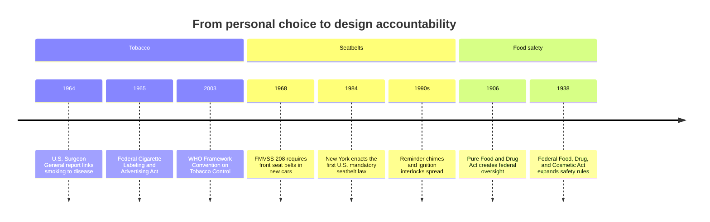

Attention, Substance, and the AI Moment · Part 15

For most of the twentieth century, smoking was sold as a personal choice and even a health aid. Seatbelts were treated as an intrusion on driver freedom. America's meatpacking industry argued that buyers should simply inspect their own food. In each case, the argument was the same: informed adults could look after themselves, so manufacturers and the state had no business redesigning products. Today the same argument is applied, almost word for word, to attention-extraction platforms.

The precedents matter because they show how societies change their minds. Harmful products do not usually become safer because users are lectured into virtue. They become safer when evidence accumulates, victims organize, courts assign liability, and regulators turn that pressure into design rules. Attention-extraction platforms are not identical to tobacco, seatbelts, or contaminated food, but they sit at a similar inflection point: the harms are becoming visible, the design choices are becoming legible, and the question is whether the transition from "personal responsibility" to "design accountability" will happen here too.

<h2 id="from-personal-choice-to-public-problem">From Personal Choice to Public Problem</h2>

Tobacco is the most familiar case. In the early 1900s cigarettes were marketed as soothing, modern, and even beneficial. Advertisements featured doctors and athletes. The frame was consumer choice, and the consumer was assumed to be free and informed. Claim C1

The shift did not happen quickly. It took decades of epidemiology, surgeon-general reports, litigation, and public campaigns before the regulatory frame moved from "smoker's choice" to "industry accountability." The WHO Framework Convention on Tobacco Control now treats packaging, advertising, and sales restrictions as design-level interventions because individual willpower turned out to be an unreliable firewall against mass marketing. The product did not change overnight; the social contract around it did.

<h2 id="defaults-and-design-standards">Defaults and Design Standards</h2>

Seatbelts and food safety show a different but complementary pattern. Both were once treated as matters of personal care: fasten your own belt, inspect your own meat. Yet behavior changed most dramatically when the design itself changed. Claim C2

NHTSA data show that seatbelt use rose dramatically after states combined laws with ignition interlocks, reminder chimes, and crash-test standards. The change was not primarily educational; it was structural. A person stepping into a car today encounters a default that makes safety easier than risk.

Food safety followed a similar arc. Muckraking journalism made slaughterhouse conditions visible, but the lasting change came from inspection regimes and processing standards that made producers, not consumers, responsible for contamination. The Pure Food and Drug Act and its successors did not rely on shoppers bringing microscopes to the grocery store. They changed the design of the supply chain.

<h2 id="what-the-transitions-share">What the Transitions Share</h2>

None of these cases followed a single path. Tobacco moved through epidemiology, litigation, and treaty law. Seatbelts moved through crash data, insurance pressure, and vehicle standards. Food safety moved through journalism, public outrage, and regulatory inspection. But they shared a sequence. Claim C3

First, scientific evidence made the harm measurable. Second, advocacy and journalism made the harm visible to people who were not already victims. Third, litigation translated harm into liability and cost. Fourth, regulation rewrote the default design of products and markets. Personal responsibility did not disappear; it was joined by structural responsibility.

*Selected milestones in the shift from personal responsibility to design accountability. Sources: WHO Report on the Global Tobacco Epidemic, NHTSA, FDA historical exhibits.*

<h2 id="attention-platforms-at-an-earlier-stage">Attention Platforms at an Earlier Stage</h2>

Attention-extraction platforms are earlier in the same arc. The harms are documented but not yet settled in law. The design choices are known but not yet treated as regulated defaults. Claim C4

Evidence is accumulating: studies link heavy short-form video use to reduced executive control, sleep disruption, and anxiety; India-specific signals include rising Tele-MANAS call volume and ASER data showing adolescent smartphones used more for social media than for education. But design standards remain weak. There is no equivalent of a crash-test rating for feed design, no mandatory disclosure of algorithmic amplification, no required review of "choice architecture" for apps targeting minors.

India's digital infrastructure is young enough that the default can still be contested. The question is whether the country will treat attention extraction as a user failing or as a design problem, as it already treats contaminated food or unsafe vehicles.

<h2 id="what-this-article-does-not-claim">What This Article Does Not Claim</h2>

This article does not claim that social media is as lethal as smoking, or that a notification is like contaminated meat. The analogies are about regulatory learning, not identical risk. It also does not call for a ban on entertainment. The goal is to ask whether the design of attention platforms should be held to the same kind of accountability that societies eventually demanded from tobacco, cars, and food.

<h2 id="sources-and-method">Sources and Method</h2>

This article draws on the WHO report on the global tobacco epidemic, NHTSA seatbelt-use data, and historical accounts of United States food-safety regulation (the 1906 Pure Food and Drug Act, FDA modernization, and CDC food-safety surveillance). It uses these as analogies for attention-extraction design and does not assert identical magnitudes of harm. Causal claims about platforms are avoided where underlying studies are correlational.

<h2 id="related-in-this-series">Related in This Series</h2>

- [Historical Hinges: When Access to a Tool Did Not Guarantee Its Benefits](/articles/historical-hinges-access-is-not-benefit/) — why access alone is rarely enough.
- [The Green Revolution Trade-Off](/articles/the-green-revolution-trade-off/) — another historical case of large-scale technological adoption with uneven returns.
- [Regulation as a Floor: DSA, IT Rules, DPDP](/articles/regulation-as-a-floor-dsa-it-rules-dpdp/) — the current Indian regulatory landscape for platforms.
- [Attention, Substance, and the AI Moment](/articles/attention-substance-ai-moment/) — the full series guide and reading paths.
