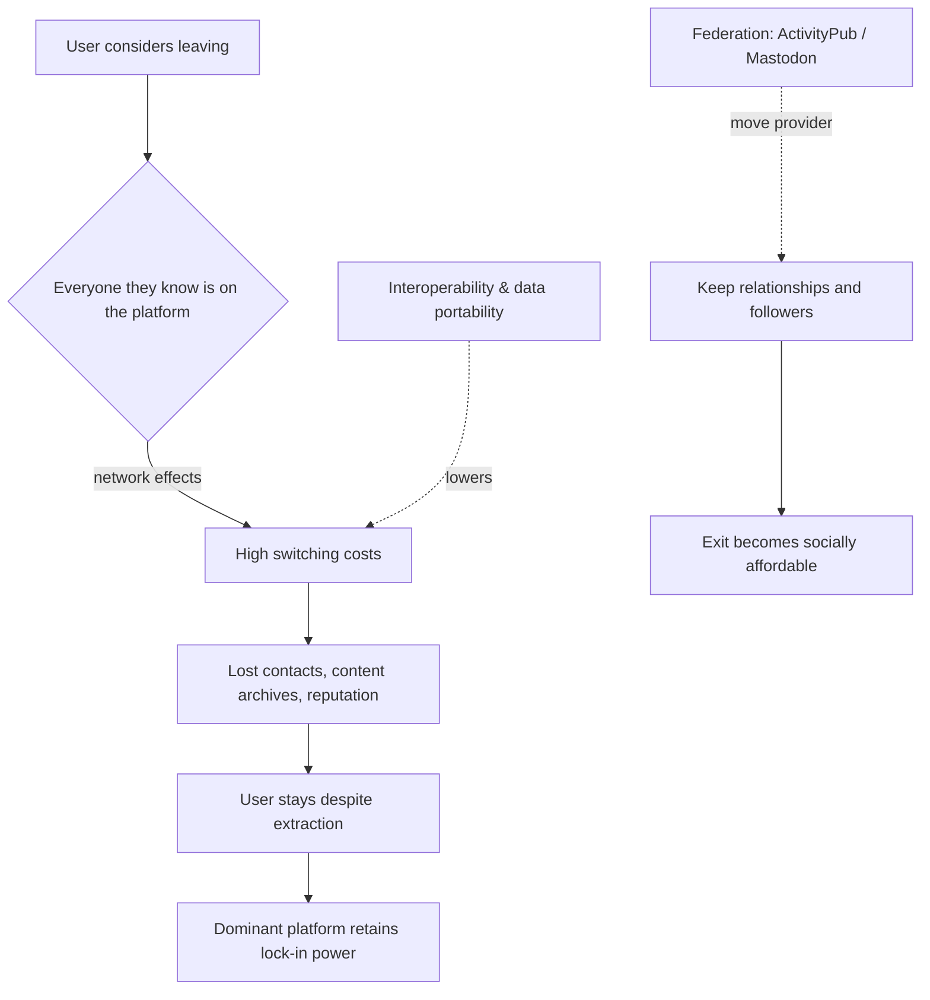

Almost everyone who has thought about quitting a social-media platform has run into the same wall. The app feels exhausting. The feed is too loud. But the family WhatsApp group is there, the work contacts are there, and the years of photos, messages, and reputation are there. Leaving is technically easy; socially, it is expensive.

Claim C1 This is the exit problem. A platform becomes more valuable as more people use it, which makes latecomers—however well-designed—start at a grave disadvantage. The lock is not primarily technical; it is relational.

<h2 id="why-network-effects-feel-like-a-lock">Why Network Effects Feel Like a Lock</h2>

Network effects are one of the most reliable forces in digital markets. A messaging app with one user is useless; with a billion users, it is infrastructure. The same logic applies to social feeds, video platforms, professional networks, and payment apps. Each additional user makes the service more useful for everyone else, so dominance tends to compound.

In India, this shows up in everyday choices. A student may prefer a calmer, chronological feed, but her study group is on Instagram. A shopkeeper may resent a platform's fees and algorithmic whims, but his customers find him through it. A journalist may worry about amplification incentives, but the audience is on X. The platform does not have to be the best designed; it only has to be where everyone already is.

This is why competition in attention markets is different from competition in, say, soap or shoes. A dissatisfied buyer can switch soap without asking her friends to switch too. A dissatisfied user cannot switch messaging apps unless her entire social graph moves with her. The result is that extraction can persist even when users know they are being extracted.

<h2 id="the-costs-of-leaving">The Costs of Leaving</h2>

Claim C2 Switching costs are not just the price of a new app. They include lost contacts, content archives, reputation, and the invisible effort of rebuilding daily habits somewhere else.

A creator who has spent years building a following on one platform cannot port those followers to a competitor. A parent who has stored a decade of family photos cannot easily move them to another service. A professional whose identity is tied to a particular network would have to rebuild credibility from zero. Even small frictions—relearning an interface, re-adding contacts, missing a few messages during transition—are enough to keep most people where they are.

These costs are not accidents. Platform business models depend on retention. The more a user invests—contacts, content, reputation, paid subscriptions—the stronger the incentive to stay, even when the service becomes worse. This is why "just delete the app" is good individual advice that fails as a collective solution. One person leaving does not threaten the network; the network is precisely what keeps that person from leaving.

*Network effects create a lock-in loop: the value of a platform rises with the number of users, which raises the cost of leaving. Interoperability and federation lower those costs by letting users move providers or platforms without rebuilding their social graph. Diagram based on the article's claims and sources including the W3C ActivityPub specification, the EU Digital Markets Act, and OECD analysis of digital platform competition.*

<h2 id="how-interoperability-opens-the-door">How Interoperability Opens the Door</h2>

Claim C3 Data portability and interoperability can reduce lock-in by letting users move without losing everything they have built.

Portability means users can download their data—contacts, posts, photos, playlists—and take it elsewhere. Interoperability means different services can talk to each other, so a user on one app can still reach friends on another. Together, they lower the walls between platforms without requiring anyone to rebuild their social graph from scratch.

The European Union's Digital Markets Act is the most prominent recent attempt to enforce these principles. It designates large platforms as "gatekeepers" and requires them to support data portability and interoperability in core services. Whether this translates into real user choice depends on implementation, enforcement, and whether smaller competitors can actually use the open interfaces. But the direction is clear: if exit becomes cheaper, platforms have more reason to treat users well.

<h2 id="federation-and-the-return-of-choice">Federation and the Return of Choice</h2>

Claim C4 Federated protocols like ActivityPub allow users to change providers without leaving their networks. This is a different model from the centralized platform: no single company owns the whole graph.

Mastodon is the best-known example. It runs on thousands of independently operated servers, but users on one server can follow, message, and interact with users on another because they share the ActivityPub protocol. If a user dislikes how one server is run, she can move to another and keep her relationships. The network is distributed, so the exit problem shifts from "leave everyone behind" to "leave one provider behind."

Federation is not a magic fix. It introduces new challenges: moderation across servers, onboarding friction, inconsistent interfaces, and the risk that power simply moves from one giant company to a handful of large servers. Its share of total users is still small. But as a proof of concept, it shows that social networking does not have to be a winner-take-all market. The technical possibility of choice already exists.

<h2 id="sources-and-method">Sources and Method</h2>

This article draws on platform-design literature, technical specifications, regulatory sources, and economic theory: the W3C ActivityPub protocol, the Mastodon project, the EU Digital Markets Act, OECD analysis of data portability and platform competition, and Klemperer's review of switching costs and competition. It uses general network-effect theory and global platform examples; the Indian applications are illustrative, not measured in a national survey.

<h2 id="related-in-this-series">Related in This Series</h2>

- [Designing for Substance](/articles/designing-for-substance/) — platform incentives and how design chooses what is easy.
- [Engagement Is a Design Choice](/articles/engagement-is-a-design-choice/) — why ranking metrics are not inevitable.
- [Friction, Chronological Feeds, and User-Chosen Algorithms](/articles/friction-chronological-feeds-user-chosen-algorithms/) — small design changes that reduce extraction.
- [Attention, Substance, and the AI Moment](/articles/attention-substance-ai-moment/) — the full series guide and reading paths.
